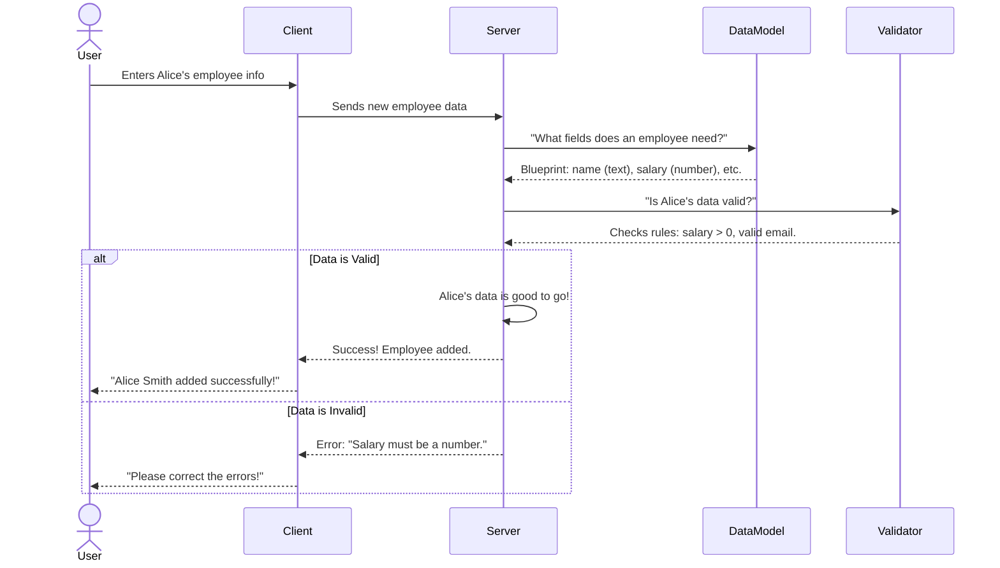

# Chapter 1: Data Models & Validation

Welcome to `PayrollPro`! In this first chapter, we're going to explore a fundamental concept that underpins any robust application: **Data Models & Validation**. Think of this as laying the groundwork, defining the very language and rules our application uses to understand and handle information.

### What Problem Are We Solving? (The Blueprint Analogy)

Imagine you're building a house. Before you even lay the first brick, you need a detailed **blueprint**. This blueprint shows:
*   What rooms the house has (kitchen, bedroom, bathroom).
*   What each room is for.
*   What materials are used (wood, concrete, glass).
*   Where the doors and windows go.

Without a blueprint, different builders might construct different parts of the house in their own way, leading to chaos and a house that doesn't fit together!

In `PayrollPro`, we're dealing with important information like `Users`, `Employees`, `Departments`, and `Payrolls`. Just like a house needs a blueprint, our application needs a clear, shared understanding of what this information looks like.

**Our central use case for this chapter:** We want to add a new employee to `PayrollPro`. What information do we need for this employee? How do we make sure that information is correct and complete?

### Core Concepts: Data Models and Validation

Let's break down the two main parts of this concept:

#### 1. Data Models: The Blueprints of Information

A **Data Model** is simply the "blueprint" or "structure" for a piece of information. It defines:
*   **What kind of information** we're dealing with (e.g., an "Employee").
*   **What pieces of data** that information contains (e.g., an Employee has a `name`, a `position`, a `salary`, a `department`).
*   **What type of data** each piece is (e.g., `name` is text, `salary` is a number, `joinDate` is a date).

**Why is this important?**
*   **Shared Understanding:** Both the part of `PayrollPro` that saves data and the part that shows data on your screen need to agree on what an "Employee" looks like.
*   **Organization:** It helps keep our data neat and organized. Imagine if some employees had a "wage" field and others had a "salary" field – very messy!

#### 2. Validation: The Quality Check

Even with a blueprint, you still need to ensure that what's being built follows the rules. **Validation** is like the "quality check" or "rule book" for our data. It includes rules such as:
*   A user's password must be at least 6 characters long.
*   An employee's salary must be a positive number.
*   An email address must be in a valid format (e.g., `name@example.com`).
*   A department name must be unique.

**Why is this important?**
*   **Data Integrity:** It ensures that our data is correct and reliable. We don't want to calculate payroll for an employee whose salary is "abc dollars"!
*   **Prevents Errors:** Catching mistakes early prevents bigger problems down the line. It's much easier to tell a user "Please enter a valid salary" than to fix a broken payroll calculation later.

### Solving Our Use Case: Adding a New Employee

Let's go back to our goal: adding a new employee, "Alice Smith", to `PayrollPro`.

To do this, we need to gather several pieces of information:
*   Alice's username, password, first name, last name, email, phone.
*   Her department, position, tax ID, bank details.
*   Her base salary and join date.

Without Data Models and Validation, we might get messy data like:
*   `salary: "ten thousand"` (text instead of a number)
*   `email: "alice@invalid"` (missing `.com` or `.org`)
*   `joinDate: "yesterday"` (text instead of a proper date)

With Data Models, `PayrollPro` knows *exactly* what information to expect for an employee and what type each piece should be. With Validation, it ensures that "Alice's" data meets all the necessary quality standards before it's ever saved.

### How it Works Behind the Scenes

Let's look at the journey of adding Alice's employee data.



In this flow:
1.  The **User** (e.g., an HR manager) types Alice's details into the `PayrollPro` website (the **Client**).
2.  The **Client** sends this information to the **Server**.
3.  The **Server** doesn't just blindly save it. First, it consults its **Data Models** to understand the expected structure of an employee.
4.  Then, it uses **Validation** rules to check if Alice's data meets all the requirements (e.g., is the salary a number? Is the email formatted correctly?).
5.  If everything is perfect, the data is processed. If there's an issue, the Server tells the Client, which then informs the User to fix it.

### Peeking at the Code: `shared/schema.ts`

In `PayrollPro`, our data models and validation rules are defined in a special file: `shared/schema.ts`. The `shared` part means these definitions are used by both the server and the client, ensuring they speak the same data language.

Let's look at some simplified parts of this file.

First, defining an Employee's structure (the Data Model blueprint):

```typescript
// --- File: shared/schema.ts ---
import { pgTable, text, serial, integer, numeric, date } from "drizzle-orm/pg-core";

export const employees = pgTable("employees", {
  id: serial("id").primaryKey(),
  userId: integer("user_id").references(() => users.id, { onDelete: "cascade" }),
  departmentId: integer("department_id").references(() => departments.id),
  position: text("position").notNull(),
  baseSalary: numeric("base_salary", { precision: 10, scale: 2 }).notNull(),
  joinDate: date("join_date").notNull(),
  status: text("status").default("active").notNull(),
});
```
*   `pgTable("employees", { ... })`: This line defines our "Employee" blueprint. It tells us we have an `employees` table.
*   `id: serial("id").primaryKey()`: Every employee gets a unique ID, automatically generated.
*   `userId: integer("user_id").references(() => users.id, { onDelete: "cascade" })`: This links an employee to a `user`. An `integer` means it's a whole number.
*   `position: text("position").notNull()`: The employee's job title, which is text and cannot be empty.
*   `baseSalary: numeric("base_salary", { precision: 10, scale: 2 }).notNull()`: This defines the salary as a number with two decimal places, and it cannot be empty.
*   `date("join_date").notNull()`: The date the employee joined.

Next, how do we get **validation rules** from this blueprint? We use a powerful tool called `zod` and `drizzle-zod`.

```typescript
// --- File: shared/schema.ts ---
import { createInsertSchema } from "drizzle-zod";
import { z } from "zod"; // Zod is the library for validation

// ... (employees table definition from above) ...

export const insertEmployeeSchema = createInsertSchema(employees).omit({
  id: true, // We don't provide an ID when inserting; it's generated automatically
});

export const loginUserSchema = z.object({
  username: z.string().min(3, "Username must be at least 3 characters"),
  password: z.string().min(6, "Password must be at least 6 characters"),
});
```

*   `createInsertSchema(employees)`: This magical function automatically creates validation rules for inserting new employees based on our `employees` blueprint! For example, it knows `position` cannot be empty because we marked it `.notNull()` in the blueprint.
*   `.omit({ id: true })`: When we create a *new* employee, we don't provide an `id` because the database generates it. This tells the validation to ignore the `id` field for *new* entries.
*   `loginUserSchema`: This is an example of `zod` being used directly to define custom validation rules.
    *   `z.object({ ... })`: We're defining rules for an "object" (like a collection of key-value pairs).
    *   `username: z.string().min(3, "...")`: The username must be a string and have at least 3 characters.
    *   `password: z.string().min(6, "...")`: The password must be a string and have at least 6 characters.

Finally, to make our code easier to read and prevent mistakes, we also define **types** using these schemas:

```typescript
// --- File: shared/schema.ts ---
import { z } from "zod";

// ... (all table and schema definitions from above) ...

// Types for database operations
export type InsertEmployee = z.infer<typeof insertEmployeeSchema>;
export type Employee = typeof employees.$inferSelect;
```

*   `export type InsertEmployee = z.infer<typeof insertEmployeeSchema>;`: This line creates a "type" called `InsertEmployee`. This type tells our code exactly what an object needs to look like when we're trying to *insert* a new employee, based on the `insertEmployeeSchema`'s rules. This helps prevent us from trying to save an employee without, say, a `position`.
*   `export type Employee = typeof employees.$inferSelect;`: This creates a type for what an employee looks like *after* it's been saved and selected from the database (it will include the `id` now).

By having these clear Data Models and Validation rules, `PayrollPro` ensures that every piece of information it handles is structured correctly and meets our quality standards.

### Conclusion

In this chapter, we've learned about the crucial role of **Data Models** as blueprints for our application's information, defining its structure and types. We also explored **Validation**, which acts as a quality control, ensuring the data is correct and reliable before it's processed or stored. We saw how these concepts help `PayrollPro` understand and handle important details like adding a new employee, preventing common errors and maintaining data quality.

Now that we understand what our data looks like and how to ensure its quality, the next step is to learn how `PayrollPro` actually saves and retrieves this data from its storage. This takes us to the [Database Interaction Layer](02_database_interaction_layer_.md).
