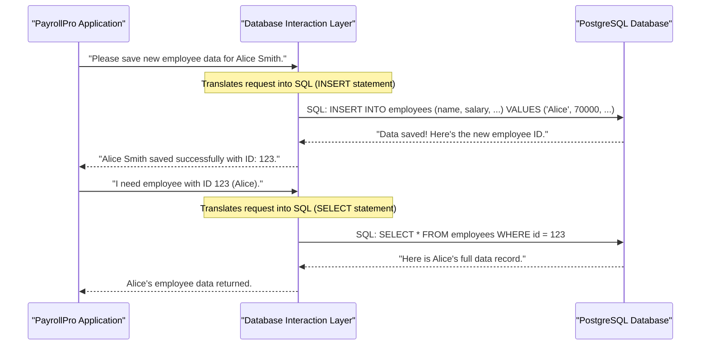

# Chapter 2: Database Interaction Layer

In [Chapter 1: Data Models & Validation](01_data_models___validation_.md), we learned how to define the "blueprint" for our data (like Employees) and how to ensure that data is correct using validation rules. We figured out exactly what information we need for "Alice Smith" and made sure it was perfect.

But once we have this perfectly structured and validated data for Alice, how do we *store* it so `PayrollPro` remembers it? And how do we *get it back* later when we need to view her details or calculate her payroll?

### What Problem Are We Solving? (The Librarian Analogy)

Imagine `PayrollPro` is a busy office, and all the important records (employee details, payrolls, departments) are stored in a huge, organized library (our database). The rest of `PayrollPro`'s functions (like showing you a list of employees or calculating payroll) need to access these records.

However, none of `PayrollPro`'s main "workers" want to learn the complicated rules of the library (like the special "SQL" language or how books are organized). They just want to say, "Get me Alice Smith's file!" or "Please save this new payroll for Bob."

This is where the **Database Interaction Layer** comes in. It's like the highly skilled **Librarian** of `PayrollPro`'s data library.

**Our central use case for this chapter:** We have the validated information for "Alice Smith" (from Chapter 1), and our goal is to understand how `PayrollPro` uses its Database Interaction Layer to **reliably save Alice's data into the database** and how it can **fetch her data back** when needed.

### Core Concepts: The Database Interaction Layer

Let's break down what this "librarian" layer does:

#### 1. The "Librarian" for Your Data

The Database Interaction Layer (DIL) is a dedicated part of our `PayrollPro` server. Its only job is to communicate directly with the **PostgreSQL database** where all our valuable information lives.

*   **You (the rest of the application)** tell the Librarian (DIL) what you need: "Find me Employee #123," or "Please add this new employee."
*   **The Librarian (DIL)** knows the complex language of the database (SQL) and how to handle its rules. It translates your simple request into precise database commands.
*   **The Librarian (DIL)** then talks to the Database, gets the result, and gives it back to you in a simple, easy-to-understand format.

#### 2. Why Do We Need a Dedicated Librarian?

*   **Isolation (Keeps Things Tidy):** Just like a real librarian frees up other office workers, the DIL keeps the messy details of database communication away from the rest of `PayrollPro`. The rest of the app doesn't need to know *how* data is stored, just *that* it can be stored and retrieved.
*   **Consistency (No Lost Books!):** The DIL ensures that data is always saved correctly and consistently. It handles complex operations, making sure that if one step fails (like transferring money from one account to another), all related steps are undone to prevent errors. This is called **Transactions**.
*   **Flexibility (Easy to Change Libraries):** If `PayrollPro` ever decides to switch from PostgreSQL to a different type of database, only the Librarian (DIL) needs to be retrained or replaced. The rest of the `PayrollPro` office can keep working as usual!

#### 3. Common Librarian Tasks (CRUD Operations)

The DIL handles the four fundamental ways we interact with data, often called **CRUD**:

| Task    | Description                                       | Librarian Action                                   |
| :------ | :------------------------------------------------ | :------------------------------------------------- |
| **C**reate | Adding new data (e.g., a new employee)            | Takes new data and saves it in the correct place.  |
| **R**ead  | Getting existing data (e.g., viewing an employee's profile) | Finds and retrieves specific data.                 |
| **U**pdate | Changing existing data (e.g., updating an employee's salary) | Finds existing data and modifies it.               |
| **D**elete | Removing data (e.g., deleting a department)       | Finds and permanently removes data.                |

### Solving Our Use Case: Saving and Fetching Alice Smith

Let's go back to Alice. We have her validated employee data.



In this flow:
1.  The **PayrollPro Application** (e.g., the part that handles the "Add Employee" form) gives Alice's validated data to the **Database Interaction Layer (DIL)**.
2.  The DIL takes this data and cleverly translates it into a special command called **SQL (Structured Query Language)** that the **PostgreSQL Database** understands.
3.  The Database then performs the action (saves Alice's data) and tells the DIL that it's done, possibly giving back a new ID for Alice.
4.  The DIL passes this success message back to the Application.
5.  Later, when the Application needs Alice's data, it simply asks the DIL by her ID. The DIL translates this into another SQL command to *select* her data from the database and returns it.

### Peeking at the Code: `server/database.ts`

In `PayrollPro`, our Database Interaction Layer is primarily defined in the `server/database.ts` file. This file contains all the "librarian's instructions" for talking to our PostgreSQL database.

#### 1. Connecting to the Database

First, our librarian needs to open the library doors!

```typescript
// --- File: server/database.ts (Simplified) ---
import pg from 'pg'; // This is the library to talk to PostgreSQL
const { Pool } = pg; // We use a "Pool" for efficient connections

// Create a connection pool to our database
const pool = new Pool({
  connectionString: process.env.DATABASE_URL, // Where our database lives
  ssl:{
    rejectUnauthorized: false // Helps connect to some cloud databases
  }
});

// A small test to make sure we can talk to the database
pool.query('SELECT NOW()', (err, res) => {
  if (err) console.error('Database connection error:', err);
  else console.log('Connected to PostgreSQL database!');
});
```
*   `pg`: This is a popular Node.js library that allows our `PayrollPro` server to speak to PostgreSQL databases.
*   `Pool`: Connecting to a database takes time. A `Pool` keeps several connections ready to use, so `PayrollPro` can quickly perform many database operations without waiting for new connections to open each time.
*   `connectionString`: This is like the exact address and login details for our database. It's usually stored in a secret environment variable to keep it secure.

#### 2. The `SQLDatabase` Class: Our Librarian's Toolbox

All the specific tasks our librarian can perform are grouped together in a class called `SQLDatabase`.

```typescript
// --- File: server/database.ts (Simplified) ---
// ... (pool definition from above) ...

export class SQLDatabase {
  // This is a helper method we'll look at next:
  async withTransaction<T>(callback: (client: pg.PoolClient) => Promise<T>): Promise<T> { /* ... */ }

  // Method to get a user
  async getUser(id: number): Promise<any | undefined> { /* ... */ }

  // Method to create a new employee (for Alice!)
  async createEmployee(employeeData: any): Promise<any> { /* ... */ }

  // Method to get an employee
  async getEmployee(id: number): Promise<any | undefined> { /* ... */ }

  // ... many more methods for departments, payrolls, etc. ...
}

export const database = new SQLDatabase(); // This creates our actual "librarian" object
```
*   `SQLDatabase`: This class acts as a blueprint for our database operations. Each method inside it (`getUser`, `createEmployee`, etc.) is a specific instruction for the librarian.
*   `export const database = new SQLDatabase();`: This line creates a single instance of our `SQLDatabase` class, which we'll use throughout our server whenever we need to talk to the database.

#### 3. Saving Alice's Data (`createEmployee` Method)

This is the core of how we save Alice's information.

```typescript
// --- File: server/database.ts (Simplified createEmployee) ---
import { InsertEmployee } from '@shared/schema'; // Get Alice's "blueprint" from Chapter 1

// Inside the SQLDatabase class
async createEmployee(employee: InsertEmployee): Promise<any> {
  // We use "withTransaction" to ensure safety, explained below!
  return this.withTransaction(async (client) => {
    const result = await client.query(`
      INSERT INTO employees (
        user_id, department_id, position, tax_id, tax_status,
        bank_name, account_number, routing_number, base_salary, join_date, status
      )
      VALUES ($1, $2, $3, $4, $5, $6, $7, $8, $9, $10, $11)
      RETURNING id, user_id AS "userId", department_id AS "departmentId", position,
                base_salary AS "baseSalary", join_date AS "joinDate"
    `, [
      employee.userId,
      employee.departmentId,
      employee.position,
      employee.taxId,
      employee.taxStatus,
      employee.bankName,
      employee.accountNumber,
      employee.routingNumber,
      employee.baseSalary,
      employee.joinDate,
      employee.status || 'active' // Use default 'active' if not provided
    ]);

    return result.rows[0]; // Returns the newly created employee data, including its new ID
  });
}
```
*   `employee: InsertEmployee`: Notice that this method expects the data to follow the `InsertEmployee` blueprint we defined in [Chapter 1: Data Models & Validation](01_data_models___validation_.md)! This ensures we're only trying to save data that's properly structured and validated.
*   `` `INSERT INTO employees (...) VALUES (...)` ``: This is the actual **SQL command** that tells the database to add a new row of data into the `employees` table.
*   `$1, $2, $3, ...`: These are **placeholders**. Instead of putting Alice's actual data directly into the SQL string, we use these. This is a crucial security practice that prevents common attacks and ensures values are handled correctly. The actual values are passed in the array `[employee.userId, ...]`.
*   `RETURNING id, ...`: After the database saves the new employee, we ask it to `RETURN` the `id` (which it automatically generated) and some other fields. This way, our `PayrollPro` application immediately knows the unique ID for Alice in the database.

#### 4. Fetching Alice's Data (`getEmployee` Method)

Once Alice is saved, how do we get her back?

```typescript
// --- File: server/database.ts (Simplified getEmployee) ---

// Inside the SQLDatabase class
async getEmployee(id: number): Promise<any | undefined> {
  const result = await pool.query(`
    SELECT id, user_id AS "userId", department_id AS "departmentId", position,
           base_salary AS "baseSalary", join_date AS "joinDate", status
    FROM employees
    WHERE id = $1
  `, [id]);

  // If a row was found, return it, otherwise return undefined
  return result.rowCount > 0 ? result.rows[0] : undefined;
}
```
*   `` `SELECT ... FROM employees WHERE id = $1` ``: This is the **SQL command** to retrieve data.
    *   `SELECT ...`: Specifies which columns (pieces of data) we want. `AS "userId"` renames `user_id` from the database to `userId` for easier use in our JavaScript code.
    *   `FROM employees`: Specifies which table to get data from.
    *   `WHERE id = $1`: This is a filter. We only want the employee whose `id` matches the one we provided (e.g., Alice's `id` 123).

#### 5. Ensuring Data Consistency with Transactions (`withTransaction` Method)

Imagine you're processing payroll for an employee. This might involve:
1.  Marking their current payroll as "paid."
2.  Updating their vacation balance.
3.  Recording the payment in the finance ledger.

What if step 1 succeeds, but step 2 fails due to a network error? Without transactions, you'd have a half-finished operation: the payroll is marked paid, but the vacation balance isn't updated, leading to inconsistencies.

**Transactions** are the database's way of saying: "Treat these multiple operations as one single, indivisible unit."

*   **All or Nothing:** Either *all* the steps in a transaction succeed and are permanently saved (`COMMIT`), or if *any* step fails, *all* the steps are automatically undone (`ROLLBACK`), leaving the database exactly as it was before the transaction started.

The `withTransaction` method in `server/database.ts` provides this safety net:

```typescript
// --- File: server/database.ts (Simplified withTransaction) ---
import pg from 'pg'; // Still need this for PoolClient type

// Inside the SQLDatabase class
async withTransaction<T>(callback: (client: pg.PoolClient) => Promise<T>): Promise<T> {
  const client = await pool.connect(); // Get a single connection from the pool

  try {
    await client.query('BEGIN'); // Step 1: Tell the database to START a transaction
    const result = await callback(client); // Step 2: Perform your database operations
    await client.query('COMMIT'); // Step 3: If everything went well, make changes PERMANENT
    return result;
  } catch (error) {
    await client.query('ROLLBACK'); // Step 4: If ANY error happened, UNDO everything
    throw error; // Re-throw the error so the application knows it failed
  } finally {
    client.release(); // Step 5: Always return the connection to the pool
  }
}
```
*   `BEGIN`: Starts the transaction. From this point, all changes are temporary until a `COMMIT` or `ROLLBACK`.
*   `callback(client)`: This is where the actual database operations (like `INSERT` or `UPDATE`) happen, using the *same* `client` connection. This ensures they are all part of the same transaction.
*   `COMMIT`: If all operations within the `callback` complete successfully, `COMMIT` makes all those temporary changes permanent.
*   `ROLLBACK`: If an error occurs at any point, `ROLLBACK` undoes all temporary changes made since the `BEGIN`, restoring the database to its state before the transaction started.
*   `finally { client.release(); }`: It's super important to always return the `client` connection to the pool so it can be reused.

You can see how methods like `createEmployee`, `updateEmployee`, and `deleteDepartment` (which checks for employees before deleting) all use this `withTransaction` helper to ensure data consistency. For example, `deleteEmployee` first deletes all associated payrolls and *then* the employee, all within one safe transaction.

### Conclusion

In this chapter, we've explored the **Database Interaction Layer**, our dedicated "librarian" that manages all communication with the PostgreSQL database. We learned how it acts as an essential buffer, translating `PayrollPro`'s requests into database-specific commands (SQL) and ensuring data consistency through **transactions**. We saw how this layer allows `PayrollPro` to reliably **save** new employee data like Alice Smith's and **fetch** it back when needed.

Now that we understand how `PayrollPro` stores and retrieves data, the next logical step is to learn how other parts of `PayrollPro` (and even other applications) can send and receive this data over the internet. This brings us to [API Endpoints](03_api_endpoints_.md).
