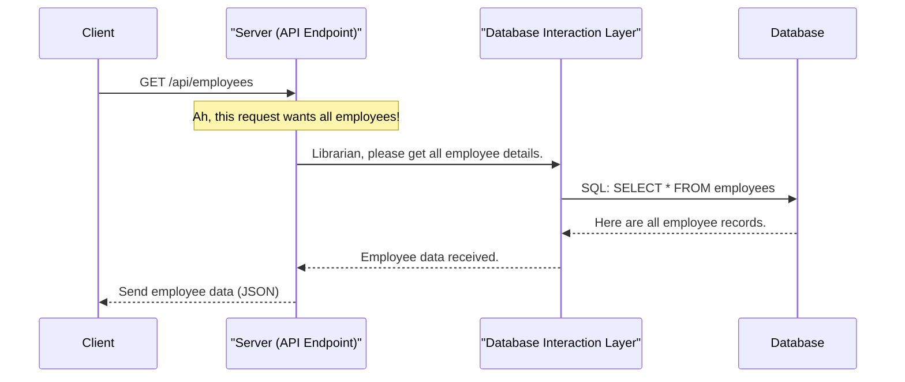

# Chapter 3: API Endpoints

In [Chapter 1: Data Models & Validation](01_data_models___validation_.md), we learned about the "blueprints" for our data, like what an Employee record should look like and how to ensure it's correct. Then, in [Chapter 2: Database Interaction Layer](02_database_interaction_layer_.md), we discovered how `PayrollPro`'s "librarian" safely saves and retrieves that data from our database.

Now, imagine our `PayrollPro` application. Part of it runs on a server (the "backend"), and another part is what you see in your web browser (the "frontend"). How do these two parts talk to each other? How does the frontend ask the backend for "all employees" or tell it to "create a new department"?

### What Problem Are We Solving? (The Restaurant Menu Analogy)

Think of `PayrollPro`'s server as a busy **restaurant kitchen**. It knows how to cook all sorts of dishes (perform operations like fetching employee data, processing payrolls, etc.). The part of `PayrollPro` you use in your browser is like the **customer** sitting at a table.

As a customer, you don't go into the kitchen and start telling the chefs how to chop vegetables or cook the meat. Instead, you look at the **menu**. Each item on the menu tells you:
*   What dish you can order (e.g., "Grilled Salmon").
*   How to order it (e.g., "Order 1").
*   What you'll get back (e.g., a cooked salmon dish).

In `PayrollPro`, **API Endpoints** are exactly like this menu. They are the specific "dishes" or "services" that the server offers. The frontend (customer) uses these endpoints to make requests, and the server (kitchen) knows exactly what to do and what to serve back.

**Our central use case for this chapter:** We want to display a list of all employees on the `PayrollPro` dashboard, and also be able to add a brand new department. How does the frontend send these requests to the backend server?

### Core Concepts: API Endpoints

Let's break down the key ideas behind these "menu items."

#### 1. What are API Endpoints?

An **API Endpoint** (API stands for Application Programming Interface) is a specific internet address (like a unique URL) that points to a specific function or piece of data on our server.

For `PayrollPro`:
*   To get all employees, there might be an endpoint like `/api/employees`.
*   To create a new department, there might be `/api/departments`.

These are the "entry points" where the frontend sends its requests.

#### 2. HTTP Methods: How You "Order"

Just like you might "order" a dish or "ask for the bill," there are different ways to interact with an endpoint. These are called **HTTP Methods** (HTTP is the language web browsers and servers use to talk).

Here are the most common ones:

| HTTP Method | What it Means (Restaurant Analogy)         | Common Use in `PayrollPro`                 |
| :---------- | :----------------------------------------- | :----------------------------------------- |
| **GET**     | "Give me this dish" (Retrieve information) | Fetch a list of employees, get a specific payroll. |
| **POST**    | "Create a new dish" (Send new information) | Add a new employee, create a new department. |
| **PATCH**   | "Change part of this dish" (Update existing information) | Update an employee's salary, change a department name. |
| **DELETE**  | "Remove this dish" (Remove information)    | Delete an employee, remove a department.   |

#### 3. Requests and Responses: Talking Back and Forth

When the frontend "orders" from an API endpoint, it sends a **Request**. The server then "serves" back a **Response**.

*   **Request:** Contains what the frontend wants to do (e.g., "GET all employees") and any necessary information (e.g., "new department name: HR"). This information is often sent in a structured format called **JSON** (JavaScript Object Notation), which is just a fancy way of organizing data into easy-to-read key-value pairs.

    ```json
    // Example: A JSON request to create a new department
    {
      "name": "Human Resources",
      "description": "Manages employee relations and recruitment"
    }
    ```

*   **Response:** Contains the server's answer. This could be the data requested (e.g., a list of employees), a success message, or an error message if something went wrong. Responses also use JSON. They also include a **Status Code**, which is a number telling you if the request was successful (like 200 OK, 201 Created) or if there was an error (like 404 Not Found, 500 Server Error).

    ```json
    // Example: A JSON response after successfully creating a department
    {
      "id": 5,
      "name": "Human Resources",
      "description": "Manages employee relations and recruitment"
    }
    ```

### Solving Our Use Case: Getting Employees and Creating Departments

Let's see how `PayrollPro` uses API Endpoints to solve our two goals:

**Goal 1: Display a list of all employees.**
The frontend needs to *get* information. It will use the `GET` method.
*   **Endpoint:** `/api/employees`
*   **Frontend Request:** Send a `GET` request to `https://payrollpro.com/api/employees` (no special data needed in the request body).
*   **Backend Response:** A list of all employees, looking something like this (simplified):

    ```json
    [
      {
        "id": 1,
        "firstName": "Alice",
        "lastName": "Smith",
        "position": "Software Engineer"
        // ... more employee details
      },
      {
        "id": 2,
        "firstName": "Bob",
        "lastName": "Johnson",
        "position": "HR Manager"
        // ... more employee details
      }
    ]
    ```

**Goal 2: Add a brand new department.**
The frontend needs to *send* new information. It will use the `POST` method.
*   **Endpoint:** `/api/departments`
*   **Frontend Request:** Send a `POST` request to `https://payrollpro.com/api/departments` with the new department's details in JSON:

    ```json
    {
      "name": "Marketing",
      "description": "Handles promotions and brand awareness"
    }
    ```
*   **Backend Response:** The details of the newly created department, including its unique ID:

    ```json
    {
      "id": 6,
      "name": "Marketing",
      "description": "Handles promotions and brand awareness"
    }
    ```

### How it Works Behind the Scenes

Let's trace how a request for "all employees" travels through `PayrollPro`.



In this flow:
1.  The **Client** (your web browser running `PayrollPro`) sends a `GET` request to the `/api/employees` endpoint on the server.
2.  The **Server (API Endpoint)** receives this request. It's like the restaurant staff checking the menu to see what "dish" `/api/employees` corresponds to.
3.  The Server then knows it needs to get employee data. It asks the **Database Interaction Layer (DIL)** (our "Librarian" from [Chapter 2: Database Interaction Layer](02_database_interaction_layer_.md)) to fetch this information.
4.  The **DIL** talks to the **Database**, retrieves the employees.
5.  The **DIL** gives the employee data back to the **Server**.
6.  Finally, the **Server** packages this employee data into a JSON response and sends it back to the **Client**.

### Peeking at the Code: `server/routes.ts`

In `PayrollPro`, all our API Endpoints are defined in the `server/routes.ts` file. This file uses a popular web framework called `express` to help us create these endpoints easily.

Let's look at how the `GET /api/employees` endpoint is set up:

```typescript
// --- File: server/routes.ts (Simplified) ---
import express, { Request, Response } from 'express';
import { database } from './database'; // Our "Librarian" from Chapter 2
import { authenticate } from './auth'; // More on this in Chapter 4!

// ... other setup code ...

export async function registerRoutes(app: express.Express): Promise<any> {
  // ... database view and trigger creation code ...

  // Employee routes
  app.get('/api/employees', authenticate, async (req: Request, res: Response) => {
    try {
      // 1. Ask the Database Interaction Layer for all employees
      const employees = await database.getAllEmployeesWithDetails();
      // 2. Send the employees back as a JSON response
      res.json(employees);
    } catch (error: any) {
      // If something goes wrong, send an error message
      res.status(500).json({ message: error.message });
    }
  });

  // ... other endpoint definitions ...
  return app; // In real code, it returns an HTTP server, simplified here.
}
```
*   `app.get('/api/employees', ...)`: This line defines a `GET` endpoint.
    *   `/api/employees`: This is the specific URL path for this endpoint.
    *   `authenticate`: This is a "middleware" (a function that runs before our main logic) that checks if the user is logged in. We'll learn more about this in [Chapter 4: Authentication & Authorization](04_authentication___authorization_.md).
    *   `async (req, res) => { ... }`: This is the function that runs when someone accesses this endpoint.
        *   `req`: Stands for "request," containing all the details about the incoming request.
        *   `res`: Stands for "response," which we use to send data back.
*   `const employees = await database.getAllEmployeesWithDetails();`: Here, our server uses the `database` object (our "librarian" from [Chapter 2: Database Interaction Layer](02_database_interaction_layer_.md)) to fetch all employee data.
*   `res.json(employees);`: This sends the retrieved `employees` data back to the frontend as a JSON response.
*   `res.status(500).json({ message: error.message });`: If there's a problem (e.g., database connection error), the server sends back a 500 status code and an error message.

Now, let's look at the `POST /api/departments` endpoint, which is used for creating a new department:

```typescript
// --- File: server/routes.ts (Simplified) ---
import express, { Request, Response, NextFunction } from 'express';
import { database } from './database';
import { insertDepartmentSchema } from '@shared/schema'; // Our blueprint from Chapter 1
import { authenticate, authorizeAdmin } from './auth';
import { validateBody } from './middleware'; // For validation!

// Helper to ensure database operations are safe (from Chapter 2)
const withTransaction = (handler: (req: Request, res: Response, next: NextFunction) => Promise<any>) => {
  return async (req: Request, res: Response, next: NextFunction) => {
    try {
      await handler(req, res, next);
    } catch (error) {
      next(error);
    }
  };
};

export async function registerRoutes(app: express.Express): Promise<any> {
  // ... other setup code ...

  // Department routes
  app.post('/api/departments',
    authenticate,          // Check if user is logged in
    authorizeAdmin,        // Check if user is an administrator
    validateBody(insertDepartmentSchema), // Check if the data sent is valid (Chapter 1)
    withTransaction(async (req: Request, res: Response) => { // Ensures database safety (Chapter 2)
      try {
        // 1. Create the department using the data from the request body (req.body)
        const department = await database.createDepartment(req.body);
        // 2. Send back the newly created department with a 201 "Created" status
        res.status(201).json(department);
      } catch (error: any) {
        // If there's a problem, send a 400 "Bad Request" or 500 "Server Error"
        res.status(400).json({ message: error.message });
      }
    })
  );

  // ... other endpoint definitions ...
  return app;
}
```
*   `app.post('/api/departments', ...)`: Defines a `POST` endpoint.
*   `authorizeAdmin`: Another "middleware" that ensures only administrators can create departments. (More in [Chapter 4: Authentication & Authorization](04_authentication___authorization_.md)).
*   `validateBody(insertDepartmentSchema)`: This is where the **validation** we discussed in [Chapter 1: Data Models & Validation](01_data_models___validation_.md) comes into play. It automatically checks if the incoming data (`req.body`) for the new department follows our `insertDepartmentSchema` blueprint before the server even tries to save it. If it's not valid, it sends an error back.
*   `withTransaction(...)`: This helper function (explained in [Chapter 2: Database Interaction Layer](02_database_interaction_layer_.md)) wraps our database operation to ensure that if any part of the process fails, the database remains in a consistent state.
*   `const department = await database.createDepartment(req.body);`: The validated data from the request body (`req.body`) is passed to the `database` "librarian" to create the new department.
*   `res.status(201).json(department);`: A `201` status code is sent, which means "Created successfully," along with the details of the new department.

As you can see, API Endpoints are the communication bridge. They combine our **Data Models** (for validation), our **Database Interaction Layer** (for storing/retrieving data), and add a layer of rules and routing for how the outside world interacts with `PayrollPro`.

### Conclusion

In this chapter, we've learned that **API Endpoints** are the "menu items" that define how the `PayrollPro` frontend (or any other application) can communicate with the backend server. We explored different **HTTP methods** like `GET` and `POST` for various actions, and how **requests** and **responses** (often using JSON) carry information back and forth. We saw how `PayrollPro` uses endpoints to fetch employee lists and create new departments, tying together concepts from our previous chapters.

However, we briefly touched upon `authenticate` and `authorizeAdmin` middleware. How does `PayrollPro` know who is asking for data, and whether they are allowed to access or change certain information? This critical aspect of security takes us to [Chapter 4: Authentication & Authorization](04_authentication___authorization_.md).
