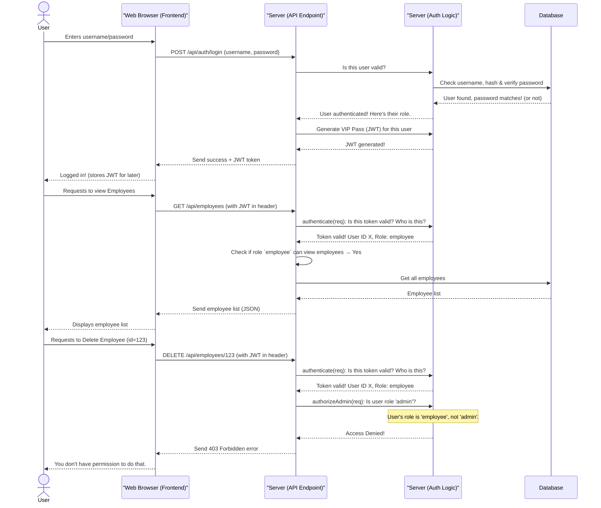

# Chapter 4: Authentication & Authorization

In [Chapter 1: Data Models & Validation](01_data_models___validation_.md), we defined the structure and rules for our data. In [Chapter 2: Database Interaction Layer](02_database_interaction_layer_.md), we learned how to safely store and retrieve that data. And in [Chapter 3: API Endpoints](03_api_endpoints_.md), we saw how our frontend talks to the backend using "menu items" (endpoints).

However, we briefly mentioned special steps like `authenticate` and `authorizeAdmin` in Chapter 3. What do these do? And why are they so important for `PayrollPro`?

### What Problem Are We Solving? (The VIP Party Analogy)

Imagine `PayrollPro` is a very exclusive and organized VIP party. There are different areas: a general lounge, a private HR office, and a highly secure server room.

*   **The Problem:** Not everyone should be allowed into every area or do everything at the party. You wouldn't want a regular employee to accidentally delete payroll records, right? We need a way to:
    1.  **Know who is trying to enter** (Are you Alice Smith or a stranger?).
    2.  **Decide what they are allowed to do** once they're in (Can Alice enter the HR office? Can she approve payroll?).

This is exactly what **Authentication & Authorization** solve.

**Our central use case for this chapter:** We want to ensure that only logged-in users can view the list of employees, and only administrators (like an HR manager) can delete an employee record.

### Core Concepts: Authentication and Authorization

Let's break down these two crucial "security checkpoints":

#### 1. Authentication: "Who are you?" (The ID Check)

**Authentication** is the process of verifying a user's identity. It's like checking someone's ID at the door of our VIP party.

*   **How it Works:** When you log into `PayrollPro` with your username and password, the server checks if they match what's stored in the database.
*   **The "VIP Pass" (JWT):** If your username and password are correct, `PayrollPro` gives you a special "VIP Pass" called a **JWT (JSON Web Token)**. This token is like a digital stamp on your hand that says, "This person is verified." For the rest of your session, instead of showing your ID every time, you just flash your VIP pass.

#### 2. Authorization: "What are you allowed to do?" (The Permissions)

**Authorization** is the process of determining what actions a *verified* user is permitted to perform. It's like, once you're inside the party with your VIP Pass, deciding if you can enter the HR office or just stay in the general lounge.

*   **User Roles:** In `PayrollPro`, users have different **roles**, like:
    *   `employee`: Can view their own payslips, update their profile.
    *   `manager`: Can view their team's details, approve leaves.
    *   `admin`: Can do *everything* – add/delete employees, manage departments, run payroll.
*   **Checking Permissions:** Every time you try to do something sensitive (like deleting an employee or accessing a special report), `PayrollPro` checks your VIP Pass (JWT) to see your role, and then consults its rules to see if your role has permission for that specific action.

| Feature            | Authentication (Who?)        | Authorization (What can they do?)  |
| :----------------- | :--------------------------- | :--------------------------------- |
| **Purpose**        | Verifies identity            | Determines permissions             |
| **Analogy**        | Checking ID at the door      | Deciding access to VIP areas       |
| **`PayrollPro` Example** | Login with username/password | Admin can delete records, Employee can view only their own profile. |

### Solving Our Use Case: Logging In and Controlling Access

Let's apply these concepts to our goal: allowing logged-in users to view employees and only admins to delete them.

1.  **Login:**
    *   You enter your `username` and `password`.
    *   `PayrollPro` authenticates you. If successful, it gives you a **JWT token**.
    *   This token contains your `userId`, `username`, and crucially, your `role` (e.g., `employee` or `admin`).

2.  **Viewing Employees (Anyone logged in):**
    *   When you ask for the employee list, your web browser automatically sends your **JWT token** along with the request to the `/api/employees` endpoint.
    *   The `authenticate` step (a "middleware" function) in `PayrollPro` checks your JWT. Is it valid? Has it expired? If yes, it confirms your identity.
    *   Since viewing employees is allowed for any authenticated user, the request proceeds.

3.  **Deleting an Employee (Only Admin):**
    *   When you try to delete an employee, your browser sends your **JWT token** to the `/api/employees/:id` endpoint (with a `DELETE` method).
    *   First, the `authenticate` middleware verifies your token, just like before.
    *   Next, the `authorizeAdmin` middleware kicks in. It looks at your `role` inside the token. If your role is `admin`, you're allowed to proceed. If it's anything else, `PayrollPro` immediately says, "Access Denied!" and prevents the deletion.

### How it Works Behind the Scenes

Let's trace the journey of a user logging in and then trying to perform actions.



### Peeking at the Code: `server/auth.ts` and `server/routes.ts`

In `PayrollPro`, the core logic for Authentication and Authorization lives in `server/auth.ts` and is used by API endpoints defined in `server/routes.ts`.

#### 1. Managing Passwords and Tokens (`server/auth.ts`)

This file contains functions to handle user login, registration, and the creation/verification of JWTs.

```typescript
// --- File: server/auth.ts (Simplified) ---
import jwt from 'jsonwebtoken'; // For JWTs
import bcrypt from 'bcrypt';   // For hashing passwords
import { database } from './database'; // Our "Librarian" from Chapter 2

// Hash a password (for storing it securely)
export async function hashPassword(password: string): Promise<string> {
  const saltRounds = 10; // How much "work" goes into hashing
  return bcrypt.hash(password, saltRounds);
}

// Verify password (when a user tries to log in)
export async function verifyPassword(password: string, hashedPassword: string): Promise<boolean> {
  return bcrypt.compare(password, hashedPassword);
}

// Generate JWT token (the "VIP Pass")
export function generateToken(user: any): string {
  const payload = {
    userId: user.id,
    username: user.username,
    role: user.role // This is key for authorization!
  };
  const JWT_SECRET = process.env.JWT_SECRET || 'payroll_app_secret_key';
  return jwt.sign(payload, JWT_SECRET, { expiresIn: '24h' }); // Expires in 24 hours
}

// Verify JWT token (check if the VIP Pass is real and valid)
export function verifyToken(token: string): any {
  const JWT_SECRET = process.env.JWT_SECRET || 'payroll_app_secret_key';
  try {
    return jwt.verify(token, JWT_SECRET); // Decodes and checks signature/expiration
  } catch (error) {
    return null; // Token is invalid or expired
  }
}
```
*   `hashPassword` & `verifyPassword`: These use `bcrypt` to store passwords safely. We never store raw passwords, only their "hashed" versions.
*   `generateToken`: After successful login, this creates the JWT. It includes the user's `id`, `username`, and `role`. This `role` is what authorization checks will use!
*   `verifyToken`: This function checks if a token is valid and returns the information (payload) stored inside it.

#### 2. The Authentication & Authorization Middleware (`server/auth.ts` continued)

These are the "guards" at our API endpoints, checking credentials and permissions.

```typescript
// --- File: server/auth.ts (Simplified Authentication & Authorization Middleware) ---
import { Request, Response, NextFunction } from 'express';

// ... (previous functions like generateToken, verifyToken) ...

// Authentication middleware: Checks the VIP Pass
export function authenticate(req: Request, res: Response, next: NextFunction) {
  // Get token from "Authorization: Bearer ..." header or cookie
  const authHeader = req.headers.authorization;
  let token: string | undefined;

  if (authHeader && authHeader.startsWith('Bearer ')) {
    token = authHeader.substring(7); // "Bearer " is 7 chars
  } else if (req.cookies && req.cookies.token) {
    token = req.cookies.token;
  }

  if (!token) {
    return res.status(401).json({ message: 'Authentication required' }); // No token, no entry!
  }

  const decoded = verifyToken(token); // Verify the VIP Pass
  if (!decoded) {
    return res.status(401).json({ message: 'Invalid or expired token' }); // Pass is fake or expired
  }

  req.user = decoded; // Add user data (id, username, role) to the request for later use
  next(); // All good, let the request proceed to the next step
}

// Authorization middleware: Checks user role
export function authorizeAdmin(req: Request, res: Response, next: NextFunction) {
  // We expect req.user to be set by the 'authenticate' middleware
  if (!req.user || req.user.role !== 'admin') {
    return res.status(403).json({ message: 'Admin access required' }); // Not an admin, access denied!
  }

  next(); // User is admin, let the request proceed
}
```
*   `authenticate`: This function is called for any endpoint that requires a user to be logged in. It extracts the JWT from the incoming request, verifies it, and if valid, attaches the `user` information (including their `role`) to the `req` (request) object. This makes the user's details available to subsequent middleware and the main route logic.
*   `authorizeAdmin`: This middleware checks if the `role` attached to `req.user` (by `authenticate`) is specifically `admin`. If not, it sends back a `403 Forbidden` error, meaning the user is known but not allowed to perform this action.

#### 3. Using Authentication & Authorization in API Endpoints (`server/routes.ts`)

Here's how these middleware functions are "plugged in" to our API endpoints:

```typescript
// --- File: server/routes.ts (Simplified Employee Endpoints) ---
import express, { Request, Response } from 'express';
import { database } from './database';
import { authenticate, authorizeAdmin } from './auth'; // Our A&A functions!
import { validateBody } from './middleware'; // From Chapter 3
import { insertEmployeeSchema } from '@shared/schema'; // From Chapter 1

export async function registerRoutes(app: express.Express): Promise<any> {
  // Endpoint to get all employees (requires ONLY authentication)
  app.get('/api/employees', authenticate, async (req: Request, res: Response) => {
    try {
      const employees = await database.getAllEmployeesWithDetails();
      res.json(employees);
    } catch (error: any) {
      res.status(500).json({ message: error.message });
    }
  });

  // Endpoint to create a new employee (requires authentication AND admin role)
  app.post('/api/employees',
    authenticate,          // Step 1: Is the user logged in?
    authorizeAdmin,        // Step 2: Are they an admin?
    validateBody(insertEmployeeSchema), // Step 3: Is the data valid? (Chapter 1)
    async (req: Request, res: Response) => {
      try {
        const employee = await database.createEmployee(req.body);
        res.status(201).json(employee);
      } catch (error: any) {
        res.status(400).json({ message: error.message });
      }
    }
  );

  // Endpoint to delete an employee (requires authentication AND admin role)
  app.delete('/api/employees/:id',
    authenticate,          // Step 1: Is the user logged in?
    authorizeAdmin,        // Step 2: Are they an admin?
    async (req: Request, res: Response) => {
      try {
        const id = parseInt(req.params.id);
        await database.deleteEmployee(id);
        res.status(204).send(); // 204 means "No Content", successful deletion
      } catch (error: any) {
        res.status(400).json({ message: error.message });
      }
    }
  );

  return app;
}
```
*   `app.get('/api/employees', authenticate, ...)`: Notice how `authenticate` is placed *before* the main logic. This means the authentication check happens first. If it passes, the request proceeds.
*   `app.post('/api/employees', authenticate, authorizeAdmin, validateBody(insertEmployeeSchema), ...)`: For creating employees, we have a chain of security and validation. The request must pass `authenticate`, *then* `authorizeAdmin`, *then* `validateBody` before it even attempts to create the employee in the database. If any of these steps fail, the request stops with an error.

### Conclusion

In this chapter, we've uncovered the vital role of **Authentication & Authorization** as the "security checkpoints" of `PayrollPro`. We learned that **Authentication** verifies *who* a user is (like checking an ID and issuing a VIP pass/JWT), while **Authorization** determines *what* that verified user is allowed to do based on their role. We saw how `PayrollPro` uses JWTs and specialized "middleware" functions to enforce these security rules, ensuring that sensitive data and functionalities are protected, preventing unauthorized access, and maintaining the integrity of our payroll system.

Now that we understand how `PayrollPro` secures its operations, the next step is to see how all these different parts of the server work together as a complete system, coordinating to deliver the full application. This takes us to [Chapter 5: Server Orchestration](05_server_orchestration_.md).

---
