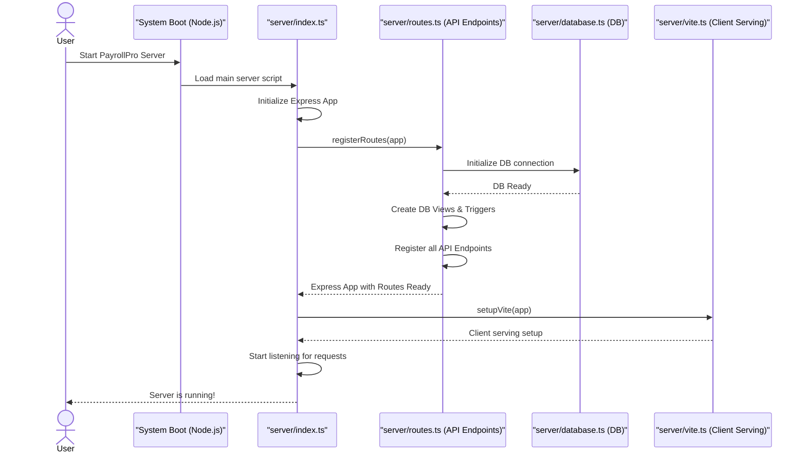

# Chapter 5: Server Orchestration

In [Chapter 1: Data Models & Validation](01_data_models___validation_.md), we created the blueprints for our data. In [Chapter 2: Database Interaction Layer](02_database_interaction_layer_.md), we learned how to store and retrieve that data safely. Then, in [Chapter 3: API Endpoints](03_api_endpoints_.md), we built the "menu items" for our frontend to talk to the backend. And in [Chapter 4: Authentication & Authorization](04_authentication___authorization_.md), we added the crucial security guards to protect our system.

Now, imagine you have all these amazing individual components: a database connection, a web framework, dozens of API endpoints, and authentication rules. They're all well-designed, but how do they *come together*? How does `PayrollPro` know to start the web server, connect to the database, and make all those API endpoints available the moment you launch the application?

### What Problem Are We Solving? (The Orchestra Conductor Analogy)

Think of `PayrollPro`'s backend as a large, complex **orchestra**. Each section of the orchestra (strings, brass, percussion) is like one of our backend components: the database layer, the API endpoints, the authentication system. Each section knows how to play its part perfectly.

But for the orchestra to play a beautiful symphony, you need a **conductor**. The conductor's job isn't to play an instrument; it's to:
*   Tell everyone when to start playing.
*   Ensure all instruments are in tune.
*   Coordinate each section so they play together harmoniously.
*   Make sure the audience (our frontend application) hears the complete performance.

In `PayrollPro`, **Server Orchestration** is exactly like this conductor. It's the central control system that ensures all the different parts of our backend server are properly initialized, connected, and working together seamlessly to handle requests from the frontend.

**Our central use case for this chapter:** When we start `PayrollPro`'s backend, how does it properly launch, connect to its database, set up all its API routes, and get ready to serve the client-side application?

### Core Concepts: Server Orchestration

Let's break down the conductor's main responsibilities:

#### 1. The Main Control Center

Server Orchestration is the "brain" or the "main function" of our backend server. It's the first thing that runs when `PayrollPro` starts up, and it's responsible for setting the stage for everything else.

#### 2. What Does It Orchestrate?

The orchestration layer has several key jobs:

*   **Starting the Server:** It uses a web framework (like Express.js) to create the actual web server that listens for incoming requests from web browsers.
*   **Setting up the Web Framework:** It configures Express.js, telling it how to handle different types of requests (like JSON data), how to use cookies, and generally preparing it for action.
*   **Integrating the Database Connection:** It makes sure our server successfully connects to the PostgreSQL database, so our "Database Interaction Layer" (our librarian from Chapter 2) can do its job.
*   **Registering All API Routes:** It tells the web server about all the "menu items" (API Endpoints from Chapter 3) that are available, associating each URL path and HTTP method with the correct code to run. This includes setting up authentication and authorization middleware.
*   **Configuring Client-Side Serving:** It determines how the frontend application (the HTML, CSS, JavaScript files that run in your browser) will be delivered to the user. In development, it often uses tools like Vite; in production, it serves pre-built static files.

#### 3. Why is it Important?

Without proper orchestration, our `PayrollPro` backend would be a collection of disconnected parts. It ensures:
*   **Smooth Startup:** The server starts correctly every time.
*   **All Services Available:** Every API endpoint and every backend feature is ready to be used.
*   **Correct Connections:** The database is connected, and everything is linked up as it should be.
*   **Reliability:** The system is stable and can handle many users.

### How it Works Behind the Scenes

Let's trace how `PayrollPro` starts up, from the moment you run the server to it being fully operational.



In this flow:
1.  The **User** starts the `PayrollPro` server (e.g., by running a command in their terminal).
2.  The **System Boot** loads the main server script, which is `server/index.ts`.
3.  `server/index.ts` initializes the core Express web application.
4.  Crucially, `server/index.ts` then calls a function in `server/routes.ts` (`registerRoutes`) to set up all the API endpoints.
5.  As part of setting up routes, `registerRoutes` ensures the **Database Manager** (`server/database.ts`) connects to the database and also creates important database structures like `views` and `triggers` (these are like pre-made queries or automatic rules in the database).
6.  `registerRoutes` then "registers" every single API endpoint (like `/api/employees`, `/api/departments`, etc.) with the Express app.
7.  Once the API is ready, `server/index.ts` then calls `setupVite` (from `server/vite.ts`) to configure how the *client-side* (frontend) application will be served.
8.  Finally, `server/index.ts` tells the entire server to start "listening" for incoming web requests on a specific port, making `PayrollPro` fully accessible.

### Solving Our Use Case: The Server's Grand Opening

Our goal is to understand how the server launches and makes everything available. This involves looking at the primary files that act as our "conductor" and its main "sheet music."

#### 1. The Conductor: `server/index.ts`

This is the very first file that Node.js runs when we start our `PayrollPro` backend. It's like the conductor stepping onto the stage.

```typescript
// --- File: server/index.ts (Simplified) ---
import express from "express";
import { registerRoutes } from "./routes"; // Imports our "sheet music" for routes
import { setupVite, serveStatic, log } from "./vite"; // Imports client-serving logic

const app = express(); // 1. Create our web application using Express

app.use(express.json()); // 2. Tell Express to understand JSON data in requests
app.use(express.urlencoded({ extended: false })); // 3. Also understand form data
// app.use(cors(...)); // 4. Allow frontend to talk to backend (simplified)
// app.use((req, res, next) => { ... }); // 5. Custom logging for requests (simplified)

(async () => {
  // 6. Call registerRoutes to set up database and API endpoints
  const server = await registerRoutes(app);

  // 7. Setup error handling for API routes
  app.use((err: any, _req: Request, res: Response, _next: NextFunction) => {
    // ... handles errors and sends them back to the client ...
    res.status(status).json({ message });
  });

  // 8. Configure how the client-side app is served (for development or production)
  process.env.NODE_ENV = "development"; // For tutorial, force development mode
  if (process.env.NODE_ENV === "development") {
    await setupVite(app, server); // Use Vite for live reloading in dev
  } else {
    serveStatic(app); // Serve pre-built files in production
  }

  // 9. Start the server and listen for incoming requests
  const port = 5000;
  server.listen({ port, host: "0.0.0.0", reusePort: true }, () => {
    log(`serving on port ${port}`); // Log a message when the server starts
  });
})();
```
*   `const app = express();`: This line creates our main Express application. Think of it as preparing the stage for the orchestra.
*   `app.use(...)`: These lines add various "middleware" functions. `express.json()` is crucial; it tells Express to automatically understand and parse JSON data that comes in requests, which is how our frontend sends data for things like creating employees or logging in.
*   `const server = await registerRoutes(app);`: This is where our conductor tells the orchestra to read its main "sheet music" from `server/routes.ts`. This call handles setting up all the API endpoints and necessary database structures.
*   `await setupVite(app, server);` or `serveStatic(app);`: After setting up the backend API, the conductor then arranges for the frontend application to be served. `setupVite` is used during development to quickly re-load changes, while `serveStatic` is for the finished, optimized version of the client.
*   `server.listen(...)`: This is the final command: "Start playing!" It makes the server accessible on port `5000`, ready to receive requests.

#### 2. The Sheet Music: `server/routes.ts` (`registerRoutes` function)

While `index.ts` is the conductor, `registerRoutes` in `server/routes.ts` is where the detailed instructions for every part of the orchestra (API endpoint, database setup) are written down.

```typescript
// --- File: server/routes.ts (Simplified registerRoutes) ---
import express, { Express } from 'express';
import { database } from './database'; // Our "Librarian" from Chapter 2
// ... import schema for validation (Chapter 1) ...
// ... import auth functions (Chapter 4) ...
// ... import middleware (like `validateBody`) ...
import cookieParser from 'cookie-parser'; // For handling cookies

export async function registerRoutes(app: Express): Promise<any> {
  // 1. Setup global middleware for all routes
  app.use(cookieParser()); // Enables parsing cookies for authentication

  // 2. Initialize Database views and functions
  // These create helpful structures and rules directly in the PostgreSQL database.
  // For example, a 'payroll_summary_view' makes it easier to get dashboard data.
  // This ensures the database is correctly set up when the server starts.
  try {
    await database.withTransaction(async (client) => {
      await client.query(`DROP VIEW IF EXISTS payroll_summary_view;`);
      await client.query(`CREATE VIEW payroll_summary_view AS ...`); // Create DB view
      await client.query(`CREATE OR REPLACE FUNCTION process_payroll(...)`); // Create DB function
    });
    console.log("Database views and functions created successfully.");
  } catch (error) {
    console.error("Failed to setup database views/functions:", error);
  }

  // 3. Register Authentication API Endpoints (Login, Register, Logout)
  app.post('/api/auth/register', validateBody(insertUserSchema), async (req, res) => { /* ... */ });
  app.post('/api/auth/login', validateBody(loginUserSchema), async (req, res) => { /* ... */ });
  app.post('/api/auth/logout', (req, res) => { /* ... */ });
  app.get('/api/auth/me', authenticate, async (req, res) => { /* ... */ });

  // 4. Register all other API Endpoints (Users, Departments, Employees, Payrolls, Dashboard)
  app.get('/api/users', authenticate, authorizeAdmin, async (req, res) => { /* ... */ });
  app.post('/api/departments', authenticate, authorizeAdmin, validateBody(insertDepartmentSchema), async (req, res) => { /* ... */ });
  // ... many more app.get, app.post, app.patch, app.delete calls for all other routes ...
  app.get('/api/employees', authenticate, async (req, res) => { /* ... */ }); // Example from Chapter 3

  // 5. Setup final error handling for API routes
  app.use('/api/*', errorHandler); // Catch any errors in API routes
  app.use('/api/*', notFound);     // Handle 404 Not Found for API routes

  // 6. Create and return the HTTP server instance
  const httpServer = createServer(app);
  return httpServer;
}
```
*   `app.use(cookieParser());`: This is another global middleware that allows Express to read cookies sent by the browser. This is essential for our authentication system to work smoothly.
*   **Database Setup (Views and Functions):** When `registerRoutes` is called, it first ensures that our PostgreSQL database has certain pre-defined `views` and `functions`. These aren't tables, but rather stored queries or mini-programs that simplify complex data retrieval (like getting a payroll summary for the dashboard) or automate certain processes (like processing payroll). This is a crucial setup step that happens when the server starts.
*   **Registering Endpoints:** The bulk of this file is dedicated to `app.get()`, `app.post()`, `app.patch()`, and `app.delete()` calls. Each of these lines registers an API endpoint. This tells Express: "When a `GET` request comes to `/api/employees`, first run `authenticate` (Chapter 4), then run this specific function to fetch employee data from the database (Chapter 2) and send it back."
*   `app.use('/api/*', errorHandler);` and `app.use('/api/*', notFound);`: These are "catch-all" error handlers for any API route. `errorHandler` catches unexpected errors and sends a proper error message back. `notFound` sends a `404 Not Found` if a request goes to an API endpoint that doesn't exist.
*   `const httpServer = createServer(app); return httpServer;`: Finally, `registerRoutes` creates the actual HTTP server instance from our configured Express app and returns it to `index.ts` so it can start listening.

By understanding `server/index.ts` as the conductor and `server/routes.ts` (specifically `registerRoutes`) as the detailed sheet music, we can see how Server Orchestration ensures that every part of the `PayrollPro` backend is initiated, connected, and ready to perform its role in the application.

### Conclusion

In this chapter, we've explored **Server Orchestration**, the vital "conductor" that brings all the individual components of our `PayrollPro` backend together. We learned how it's responsible for starting the web server, connecting to the database, setting up all the API routes, and configuring how the client-side application is served. We saw how `server/index.ts` acts as the main entry point, delegating setup tasks to `server/routes.ts`, which in turn configures all our API endpoints and necessary database structures. This coordination ensures that when `PayrollPro` launches, its entire backend system is properly initialized and ready to handle incoming requests.

Now that we understand how the backend services are orchestrated, the next step is to look at the other side of the application: how the data is managed and presented on the user's screen. This takes us to [Chapter 6: Client-Side Data Management](06_client_side_data_management_.md).

---
