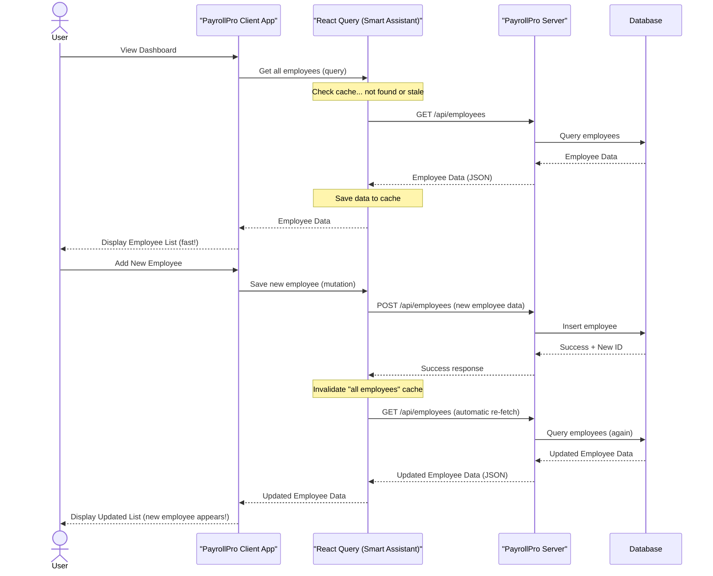

# Chapter 6: Client-Side Data Management

In [Chapter 1: Data Models & Validation](01_data_models___validation_.md), we learned about the blueprints for our data. In [Chapter 2: Database Interaction Layer](02_database_interaction_layer_.md), we saw how this data is stored and retrieved. [Chapter 3: API Endpoints](03_api_endpoints_.md) showed us how our frontend and backend communicate using "menu items" (endpoints), and [Chapter 4: Authentication & Authorization](04_authentication___authorization_.md) secured these communications. Finally, [Chapter 5: Server Orchestration](05_server_orchestration_.md) tied all these backend pieces together into a working system.

Now, let's switch our focus from the server (backend) to what you see and interact with in your web browser – the client-side (frontend) of `PayrollPro`. The backend is ready to serve data, but how does the frontend efficiently get this data, show it to you quickly, and send your updates back without making you wait constantly?

### What Problem Are We Solving? (The Smart Assistant Analogy)

Imagine you're working at your desk, and you constantly need information from a faraway filing cabinet (the backend server). Going to the cabinet, finding the file, and bringing it back takes time every single time. This would be very slow and frustrating!

What if you had a **Smart Assistant**? This assistant would:
*   **Fetch what you need:** You just tell them, "Get me the employee list." They go to the filing cabinet (backend server) and bring it back.
*   **Remember frequently used files (Cache):** If you ask for the employee list again a minute later, they already have it right there on their desk, so you get it *instantly*. They don't need to go back to the cabinet unless you ask for something very new.
*   **Know when files are old (Stale data):** If someone else (another part of the app, or another user) updates the employee list in the filing cabinet, your Smart Assistant notices and subtly goes to get the *newest* version when they have a moment.
*   **Help you send updates:** When you fill out a form to add a new employee, you give it to your Smart Assistant. They handle the task of putting it into the filing cabinet correctly and making sure *everyone* knows the employee list has changed so they can get the new version.

In `PayrollPro`, **Client-Side Data Management** is handled by a tool called **React Query**, which acts as this "Smart Assistant" for our frontend application. It makes the user interface feel incredibly fast and responsive, as it doesn't always have to wait for server responses.

**Our central use case for this chapter:** We want to display a list of employees on the `PayrollPro` dashboard. When a new employee is added, we want the list to update automatically and quickly, without the user having to manually refresh the page.

### Core Concepts: The Smart Assistant's Abilities

Let's look at the main jobs our "Smart Assistant" (React Query) handles:

#### 1. Fetching Data: Getting Information

This is about making the initial request to the backend server.
*   You ask for data (e.g., "Get me all employees").
*   The Smart Assistant talks to the backend's [API Endpoints](03_api_endpoints_.md) to retrieve the information.
*   It handles the technical details of `fetch` requests, like setting up headers and dealing with network issues.

#### 2. Caching Data: Remembering for Speed

Once data is fetched, the Smart Assistant remembers it!
*   It stores a copy of the fetched data locally in the client's memory.
*   If you ask for the *same* data again, it can give you the remembered copy *immediately* instead of waiting for another trip to the server. This is called **caching**.
*   This makes your `PayrollPro` dashboard feel very fast.

#### 3. Stale Data & Re-fetching: Keeping Information Fresh

The Smart Assistant is smart enough to know if its remembered data might be old (or "stale").
*   After a certain time, or if something changes on the server, the cached data is marked "stale."
*   When data is stale, the Smart Assistant will automatically, quietly, re-fetch the latest version from the server in the background. It might even show you the old data for a split second (making the UI feel responsive) while it fetches the new data.

#### 4. Updating Data (Mutations): Sending Changes

When you need to send new information or make changes (like adding a new employee or updating their salary):
*   You tell the Smart Assistant the changes you want to make.
*   It handles sending this data to the correct [API Endpoint](03_api_endpoints_.md) on the server (using `POST`, `PATCH`, or `DELETE` methods).
*   Crucially, after successfully sending updates, the Smart Assistant can automatically mark related cached data as "stale," triggering a re-fetch of the affected lists (e.g., if you add an employee, it tells the "all employees" list to get updated). This is called **cache invalidation**.

### Solving Our Use Case: Dynamic Employee List

Let's see how our Smart Assistant (React Query) helps us display and automatically update the employee list in `PayrollPro`.

**Goal 1: Display a list of all employees.**
1.  When the `PayrollPro` dashboard loads, the "Employee List" component asks React Query: "Please get me the list of all employees."
2.  React Query checks its cache. If the list is there and fresh, it provides it instantly.
3.  If not, React Query sends a `GET` request to `/api/employees` on our server.
4.  The server responds with the employee data (as seen in [Chapter 3: API Endpoints](03_api_endpoints_.md)).
5.  React Query receives the data, stores it in its cache, and then gives it to the "Employee List" component for display.

**Goal 2: When a new employee is added, automatically update the list.**
1.  You fill out the "Add New Employee" form and click "Save."
2.  The form component tells React Query: "Please send this new employee data to `/api/employees`." (This is a "mutation").
3.  React Query sends a `POST` request to the server with the new employee's details.
4.  The server processes the request (validates, saves to database, etc., as per Chapters 1-5) and sends a success response.
5.  Upon receiving the success, React Query automatically knows that the cached "all employees" list is now outdated. It "invalidates" that cache entry.
6.  Because the "Employee List" component is configured to automatically re-fetch when its data is stale, React Query immediately (and quietly) performs another `GET` request to `/api/employees`.
7.  The new, updated employee list is fetched, cached, and then displayed, showing the newly added employee without any manual refresh!

### How it Works Behind the Scenes

Let's visualize the Smart Assistant (React Query) in action for fetching and then updating data:



### Peeking at the Code: `client/src/lib/queryClient.ts`

In `PayrollPro`, our Smart Assistant's core setup is in `client/src/lib/queryClient.ts`. This file configures how React Query fetches data and manages its cache.

#### 1. Making API Requests: The `apiRequest` Function

This is a general helper function that handles the actual network request (talking to the server).

```typescript
// --- File: client/src/lib/queryClient.ts (Simplified) ---

// Helper to check if the server response was okay
async function throwIfResNotOk(res: Response) {
  if (!res.ok) { // If status code is 4xx or 5xx
    const text = (await res.text()) || res.statusText;
    throw new Error(`${res.status}: ${text}`); // Throw error with message
  }
}

// Function to send data to the API (e.g., for POST, PATCH, DELETE)
export async function apiRequest(
  method: string, // Like "POST", "GET", "PATCH"
  url: string,    // The API Endpoint URL (e.g., "/api/employees")
  data?: unknown, // The data to send (e.g., new employee details)
): Promise<Response> {

  const res = await fetch(url, {
    method,
    headers: data ? { "Content-Type": "application/json" } : {}, // Tell server it's JSON
    body: data ? JSON.stringify(data) : undefined, // Convert data to JSON text
    credentials: "include", // Important for sending login cookies (Chapter 4)
  });

  await throwIfResNotOk(res); // Check if the request was successful
  return res; // Return the raw response
}
```
*   `throwIfResNotOk`: This small function is a quality check. It makes sure that if the server responds with an error (like a 404 Not Found or 500 Server Error), our code knows to treat it as an error and stop.
*   `apiRequest`: This is a central function for making `fetch` calls. It takes the `method` (GET, POST, etc.), the `url` (the [API Endpoint](03_api_endpoints_.md)), and any `data` to send. It automatically sets the correct headers for JSON and includes login credentials (cookies from [Chapter 4: Authentication & Authorization](04_authentication___authorization_.md)).

#### 2. Configuring React Query: The `queryClient`

This is the main setup for our Smart Assistant. It tells React Query how to behave by default.

```typescript
// --- File: client/src/lib/queryClient.ts (Simplified) ---
import { QueryClient, QueryFunction } from "@tanstack/react-query";

// ... (apiRequest and throwIfResNotOk from above) ...

// This function tells React Query HOW to fetch data for queries
export const getQueryFn: <T>(options: {
  on401: UnauthorizedBehavior; // How to handle login errors
}) => QueryFunction<T> =
  ({ on401: unauthorizedBehavior }) =>
  async ({ queryKey }) => {
    // queryKey[0] is usually the URL for the API endpoint
    const res = await fetch(queryKey[0] as string, {
      credentials: "include", // Send login cookies
    });

    if (unauthorizedBehavior === "returnNull" && res.status === 401) {
      return null; // Don't throw error for 401, just return null (e.g., for user login status check)
    }

    await throwIfResNotOk(res); // Check if response was OK
    return await res.json(); // Convert the server's JSON response into JavaScript objects
  };

// This is our main Smart Assistant object!
export const queryClient = new QueryClient({
  defaultOptions: { // Default rules for all "Get" requests (queries)
    queries: {
      queryFn: getQueryFn({ on401: "throw" }), // Use our custom fetcher
      refetchInterval: false,        // Don't auto-refetch on a timer
      refetchOnWindowFocus: false,   // Don't auto-refetch when window gets focus
      staleTime: Infinity,           // Data is "fresh" forever by default (until we manually invalidate)
      retry: false,                  // Don't retry failed requests by default
    },
    mutations: { // Default rules for all "Send" requests (mutations)
      retry: false, // Don't retry failed mutations
    },
  },
});
```
*   `getQueryFn`: This is a special function that React Query uses internally to actually perform the `fetch` request for data. We tell it to use our `fetch` (with `credentials: "include"`) and to convert the response to JSON.
*   `queryClient = new QueryClient(...)`: This creates the actual `QueryClient` instance, which is our Smart Assistant.
*   `defaultOptions`: This section sets the default rules for how our Smart Assistant behaves:
    *   `queries`: Rules for fetching and caching data (like `GET` requests).
        *   `queryFn`: Tells it to use our `getQueryFn` (which uses `fetch`).
        *   `staleTime: Infinity`: This is a key setting. It means that once data is fetched, it's considered "fresh" indefinitely *unless* we specifically tell React Query that it's "stale" (usually after a successful mutation). This is important for performance.
        *   `refetchInterval: false`, `refetchOnWindowFocus: false`: We disable automatic re-fetching on a timer or when you switch tabs, because `staleTime: Infinity` handles this in a smarter, event-driven way (after mutations).
    *   `mutations`: Rules for sending data and making changes (like `POST`, `PATCH`, `DELETE` requests).
        *   `retry: false`: We usually don't want to automatically retry mutations, as that could accidentally send duplicate data.

#### 3. Using the Smart Assistant in React Components (Conceptual)

While the `queryClient.ts` file sets up the Smart Assistant, our actual `PayrollPro` components (e.g., the `EmployeeList.tsx` or `AddEmployeeForm.tsx`) then use special "hooks" provided by React Query to interact with it.

To fetch and display employees:
```typescript
// --- Example: client/src/pages/Dashboard.tsx (Conceptual) ---
import { useQuery } from '@tanstack/react-query'; // Import React Query hook
import { apiRequest } from '../lib/queryClient'; // Our fetcher

function EmployeeList() {
  const { data: employees, isLoading, error } = useQuery({
    queryKey: ['employees'], // A unique key for this query (our "file name")
  }); // React Query will automatically call our configured queryFn (getQueryFn)

  if (isLoading) return <div>Loading employees...</div>;
  if (error) return <div>Error: {error.message}</div>;

  return (
    <ul>
      {employees?.map(emp => (
        <li key={emp.id}>{emp.firstName} {emp.lastName}</li>
      ))}
    </ul>
  );
}
```
*   `useQuery({ queryKey: ['employees'] })`: This line is how a React component asks the Smart Assistant for data. `['employees']` is the unique name for this piece of data. React Query uses the `queryFn` we configured to fetch the data if it's not in the cache or is stale.

To add a new employee and automatically update the list:
```typescript
// --- Example: client/src/components/AddEmployeeForm.tsx (Conceptual) ---
import { useMutation, useQueryClient } from '@tanstack/react-query';
import { apiRequest } from '../lib/queryClient';

function AddEmployeeForm() {
  const queryClient = useQueryClient(); // Get access to the Smart Assistant

  // Define a mutation for adding an employee
  const addEmployeeMutation = useMutation({
    mutationFn: (newEmployeeData) => apiRequest('POST', '/api/employees', newEmployeeData),
    onSuccess: () => {
      // After successfully adding, tell the Smart Assistant to invalidate the 'employees' cache
      queryClient.invalidateQueries({ queryKey: ['employees'] });
    },
  });

  const handleSubmit = (formData) => {
    addEmployeeMutation.mutate(formData); // Trigger the mutation
  };

  return (
    <form onSubmit={handleSubmit}>
      {/* ... form fields ... */}
      <button type="submit">Add Employee</button>
      {addEmployeeMutation.isPending && <p>Adding...</p>}
      {addEmployeeMutation.isError && <p>Error: {addEmployeeMutation.error.message}</p>}
    </form>
  );
}
```
*   `useMutation`: This hook is used for sending changes to the server.
*   `mutationFn`: This tells `useMutation` *how* to send the data (using our `apiRequest` to the `/api/employees` endpoint).
*   `onSuccess: () => { queryClient.invalidateQueries({ queryKey: ['employees'] }); }`: This is the crucial part for our use case! After a new employee is successfully saved, we tell `queryClient` (our Smart Assistant) that the data identified by `['employees']` is now "stale." Because `staleTime` is `Infinity`, the Smart Assistant knows it *must* re-fetch this data the next time it's needed, thus automatically updating our displayed employee list.

### Conclusion

In this chapter, we've explored **Client-Side Data Management** using **React Query** as our "Smart Assistant." We learned how it efficiently handles fetching, caching, and updating data from the backend, making the `PayrollPro` user interface feel fast and responsive. We saw how it automatically re-fetches data when it becomes "stale" (e.g., after a new employee is added), ensuring that what you see on your screen is always fresh.

Now that we understand how data is managed and updated on the client side, the next step is to explore how different parts of the user interface are organized and navigated. This brings us to [Chapter 7: User Interface Routing](07_user_interface_routing_.md).

---
