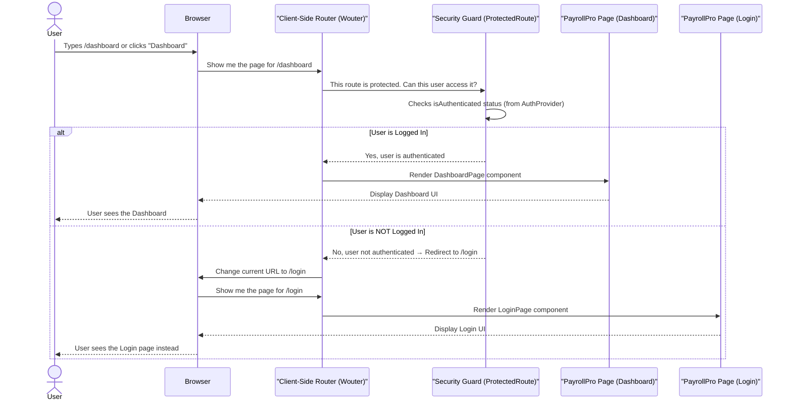

# Chapter 7: User Interface Routing

In [Chapter 1: Data Models & Validation](01_data_models___validation_.md), we defined the structure of our data. [Chapter 2: Database Interaction Layer](02_database_interaction_layer_.md) showed us how to store and retrieve it. [Chapter 3: API Endpoints](03_api_endpoints_.md) provided the "menu" for server communication, and [Chapter 4: Authentication & Authorization](04_authentication___authorization_.md) added critical security checks. Finally, [Chapter 5: Server Orchestration](05_server_orchestration_.md) tied the backend pieces together, and [Chapter 6: Client-Side Data Management](06_client_side_data_management_.md) showed how the frontend efficiently fetches and updates data.

Now, let's turn our attention to how `PayrollPro` organizes its different screens and allows users to move between them seamlessly. Imagine you're using `PayrollPro` – you see a dashboard, then click a link to view employees, then click another link to see a specific employee's details. How does `PayrollPro` know which "page" to display at any given moment?

### What Problem Are We Solving? (The Building's Navigation System Analogy)

Think of `PayrollPro` as a large, multi-room **building**. Each room is a different "page" or "view" in our application: the Dashboard, the Employees list, the Payroll details, the Settings area, and so on.

*   **The Problem:** Without a good system, users would get lost! How do they find the "Employees" room? How does the building know to show the "Payroll History" room when you click "Payroll" in the menu? And how do we make sure only authorized people (like an administrator) can enter the "Settings" room?

This is where **User Interface Routing** comes in. It's like the building's complete **navigation system**:
*   **Signs on doors:** Telling you what's inside (e.g., `/employees` for the employee list).
*   **Maps:** Showing you all the possible destinations.
*   **Corridors and paths:** Connecting different rooms.
*   **Security checkpoints at certain doors:** Ensuring only authorized individuals can enter specific rooms (like the admin-only settings).

**Our central use case for this chapter:** We want `PayrollPro` to display the employee list when a user visits the URL `/employees`. If they visit `/employees/123`, we want it to show the details for employee #123. Crucially, we also need to ensure that only logged-in users can access these pages, and specifically only *administrators* can access the `/settings` page.

### Core Concepts: The Navigation System

Let's break down the key ideas behind this client-side navigation:

#### 1. URLs as Addresses

Every "page" or distinct view in `PayrollPro` has its own unique address, just like rooms in a building. These are the URLs you see in your browser's address bar.

*   `/dashboard`: Shows the main dashboard.
*   `/employees`: Shows a list of all employees.
*   `/employees/123`: Shows the details for employee with ID 123.
*   `/login`: Shows the login screen.
*   `/settings`: Shows the system settings (for administrators only).

#### 2. Routes: The Map of Our Application

A **Route** is a rule that links a specific URL address (or a pattern of addresses) to a particular **User Interface (UI) Component** (a React page in our case). It's like entries on our building's map: "To get to the 'Employees' room, follow the `/employees` path, and you'll find the `Employees` page component there."

#### 3. Parameters: Passing Specific Information

Sometimes, a page needs specific information based on the URL. For example, `/employees/123` isn't just "employees"; it's "employee number 123." The `123` here is a **parameter**. Our routing system can "extract" this number from the URL and pass it to the `EmployeeDetails` component, so it knows *which* employee's details to load.

#### 4. Navigation: Moving Around

Users can move between pages in two main ways:
*   **Clicking Links:** The most common way. When you click a menu item or a button that acts like a link, the routing system intercepts this click and changes the displayed page without reloading the entire application. This makes the app feel fast and smooth.
*   **Programmatic Navigation:** Sometimes, our code needs to automatically send the user to a different page. For example, after a user successfully logs in, `PayrollPro` automatically navigates them to the `/dashboard`.

#### 5. Protecting Routes: The Security Checkpoints

Not all rooms in our `PayrollPro` building are open to everyone. This is where security, from [Chapter 4: Authentication & Authorization](04_authentication___authorization_.md), comes into play. We can add "security guards" to our routes:
*   **`ProtectedRoute`**: Ensures that a user **must be logged in (authenticated)** to access a page. If they try to go to `/dashboard` but aren't logged in, they are immediately sent to `/login`.
*   **`AdminRoute`**: Ensures that a user not only needs to be logged in but also **must have the `admin` role (authorized)** to access a page. If a regular employee tries to go to `/settings`, they are redirected to `/dashboard`.

### Solving Our Use Case: Displaying Pages and Protecting Access

Let's see how `PayrollPro` uses User Interface Routing to achieve our goals:

1.  **Displaying the Employee List (`/employees`):**
    *   When a user types `/employees` in the browser or clicks "Employees" in the sidebar, the routing system matches this URL to the `/employees` route.
    *   It then renders the `Employees` page component, which is responsible for displaying the list (and fetching data using [Client-Side Data Management](06_client_side_data_management_.md)).

2.  **Displaying Specific Employee Details (`/employees/123`):**
    *   When a user clicks on an employee's name in the list, the application navigates to a URL like `/employees/123`.
    *   The routing system matches this URL to a pattern like `/employees/:id`. It understands that `:id` is a placeholder for a specific employee ID (e.g., `123`).
    *   It then renders the `EmployeeDetails` page component and *passes* `123` to it. The `EmployeeDetails` component then uses this `id` to fetch the correct employee's data.

3.  **Protecting Access (Login and Admin-only):**
    *   For pages like `/employees` or `/dashboard`, the route is wrapped with a `ProtectedRoute`. This "guard" first checks if the user is `isAuthenticated` (using logic from [Chapter 4: Authentication & Authorization](04_authentication___authorization_.md)). If not, it redirects them to `/login`.
    *   For highly sensitive pages like `/settings`, the route is wrapped with an `AdminRoute`. This "guard" checks if the user's role is `admin`. If not, it redirects them to a safe page like `/dashboard`.

### How it Works Behind the Scenes

Let's trace the journey of a user trying to access a protected page in `PayrollPro`. We use a lightweight routing library called `wouter` for our client-side routing.



### Peeking at the Code: `client/src/App.tsx` and Security Route Wrappers

In `PayrollPro`, the core of our User Interface Routing is set up in `client/src/App.tsx`. This file defines all the possible URLs and which components should be displayed for each. It also uses our security "guards" to protect certain paths.

#### 1. Defining Routes in `client/src/App.tsx`

This is our main "map" for the `PayrollPro` application.

```typescript
// --- File: client/src/App.tsx (Simplified Router function) ---
import { Switch, Route } from "wouter"; // Import Wouter components
import Login from "@/pages/login";        // Import our page components
import Dashboard from "@/pages/dashboard";
import Employees from "@/pages/employees";
import EmployeeDetails from "@/pages/employee-details";
import Settings from "@/pages/settings";
import NotFound from "@/pages/not-found";
import { ProtectedRoute } from "@/components/auth/protected-route"; // Our security guard 1
import { AdminRoute } from "@/components/auth/admin-route";       // Our security guard 2

function Router() {
  return (
    <Switch>
      {/* Public routes (no login required) */}
      <Route path="/login" component={Login} />
      <Route path="/register" component={Register} />
      
      {/* Protected routes (login required) */}
      <Route path="/dashboard">
        <ProtectedRoute>
          <Dashboard /> {/* Show Dashboard if logged in */}
        </ProtectedRoute>
      </Route>
      
      <Route path="/employees">
        <ProtectedRoute>
          <Employees /> {/* Show Employees list if logged in */}
        </ProtectedRoute>
      </Route>
      
      {/* Route with a parameter for specific employee details */}
      <Route path="/employees/:id">
        {(params) => ( // Wouter passes URL parameters in `params` object
          <ProtectedRoute>
            {/* Pass the extracted 'id' to the EmployeeDetails component */}
            <EmployeeDetails id={parseInt(params.id)} /> 
          </ProtectedRoute>
        )}
      </Route>
      
      {/* Admin-only route */}
      <Route path="/settings">
        <AdminRoute>
          <Settings /> {/* Show Settings only if logged in AND admin */}
        </AdminRoute>
      </Route>
      
      {/* Default route for the homepage (redirects to dashboard if logged in) */}
      <Route path="/">
        <ProtectedRoute>
          <Dashboard />
        </ProtectedRoute>
      </Route>
      
      {/* Catch-all route for any undefined paths (404 Not Found) */}
      <Route component={NotFound} />
    </Switch>
  );
}

// ... (App component wraps Router with AuthProvider and QueryClientProvider) ...
```
*   `Switch`: This component from `wouter` ensures that only *one* `Route` matches the current URL at a time. It tries to match routes in order, from top to bottom.
*   `Route path="/login" component={Login} /`: This is a basic route. If the URL is exactly `/login`, the `Login` page component will be displayed.
*   `Route path="/employees/:id"`: This is how we define a route with a **parameter**. The `:id` acts as a placeholder. When a user visits `/employees/123`, `wouter` recognizes `123` as the `id` parameter. The function `(params) => { ... }` then receives this `params` object, allowing us to extract `params.id` and pass it to the `EmployeeDetails` component.
*   `<ProtectedRoute>` and `<AdminRoute>`: These are special components (which we'll look at next) that "wrap" our actual page components. They act as "guards," determining whether the user is allowed to see the content inside.

#### 2. The `ProtectedRoute` "Guard" (`client/src/components/auth/protected-route.tsx`)

This component ensures that only authenticated users can see the pages it protects.

```typescript
// --- File: client/src/components/auth/protected-route.tsx (Simplified) ---
import { ReactNode, useEffect } from 'react';
import { useLocation } from 'wouter'; // To get current location and navigate
import { useAuth } from '@/lib/auth';  // Our authentication context from Chapter 4

interface ProtectedRouteProps {
  children: ReactNode; // This means it can wrap any React content
}

export function ProtectedRoute({ children }: ProtectedRouteProps) {
  const [, navigate] = useLocation(); // `navigate` function allows us to change the URL
  const { isAuthenticated, loading } = useAuth(); // Get user's auth status

  useEffect(() => {
    // If we're done loading auth status AND the user is NOT authenticated
    if (!loading && !isAuthenticated) {
      navigate('/login'); // Automatically send them to the login page
    }
  }, [isAuthenticated, loading, navigate]); // Re-run this effect if these values change

  // While loading, show a loading message
  if (loading) {
    return (
      <div className="h-screen flex items-center justify-center">
        <p>Loading...</p>
      </div>
    );
  }
  
  // If authenticated, show the child components (the actual page)
  // Otherwise, return null (because we've already navigated them away)
  return isAuthenticated ? <>{children}</> : null;
}
```
*   `useLocation()`: This hook from `wouter` gives us the `navigate` function, which we use to programmatically change the URL (e.g., redirect to `/login`).
*   `useAuth()`: This custom hook (from [Chapter 4: Authentication & Authorization](04_authentication___authorization_.md)) provides the `isAuthenticated` status and `loading` state for our user.
*   `useEffect`: This React feature runs code when certain values change. Here, it checks if the user is authenticated after the app finishes loading their auth status. If not, `navigate('/login')` sends them to the login page.
*   `return isAuthenticated ? <>{children}</> : null;`: If the user *is* authenticated, `ProtectedRoute` simply renders its `children` (which is the actual page component like `Dashboard` or `Employees`). If not, it returns `null` because the `useEffect` has already initiated a redirect.

#### 3. The `AdminRoute` "Guard" (`client/src/components/auth/admin-route.tsx`)

This is very similar to `ProtectedRoute`, but it specifically checks for the `admin` role.

```typescript
// --- File: client/src/components/auth/admin-route.tsx (Simplified) ---
import { ReactNode, useEffect } from 'react';
import { useLocation } from 'wouter';
import { useAuth } from '@/lib/auth'; // Imports `isAdmin` flag

interface AdminRouteProps {
  children: ReactNode;
}

export function AdminRoute({ children }: AdminRouteProps) {
  const [, navigate] = useLocation();
  const { isAdmin, loading } = useAuth(); // Get isAdmin status

  useEffect(() => {
    // If not loading and user is NOT an admin
    if (!loading && !isAdmin) {
      navigate('/dashboard'); // Send them to the dashboard (a non-admin page)
    }
  }, [isAdmin, loading, navigate]);

  if (loading) {
    return (
      <div className="h-screen flex items-center justify-center">
        <p>Loading...</p>
      </div>
    );
  }
  
  // If user IS an admin, show the children (the settings page)
  return isAdmin ? <>{children}</> : null;
}
```
*   `isAdmin`: This flag from `useAuth()` (from [Chapter 4: Authentication & Authorization](04_authentication___authorization_.md)) tells us if the currently logged-in user has the administrator role.
*   If `!isAdmin`, the user is redirected to `/dashboard`, preventing them from accessing admin-only content.

#### 4. How Pages Use Navigation and Parameters (e.g., `client/src/pages/employee-details.tsx`)

Page components often need to receive parameters or trigger navigation.

```typescript
// --- File: client/src/pages/employee-details.tsx (Simplified) ---
import { useState } from 'react';
import { useLocation } from 'wouter'; // To get navigate function
import { useQuery } from '@tanstack/react-query'; // To fetch data
import { useAuth } from '@/lib/auth'; // For authentication check
import { Header } from '@/components/ui/header';
import { Sidebar } from '@/components/ui/sidebar';
import { EmployeeForm } from '@/components/employees/employee-form';

interface EmployeeDetailsProps {
  id?: number; // This prop will receive the ID from the URL parameter
}

export default function EmployeeDetails({ id }: EmployeeDetailsProps) {
  const [, navigate] = useLocation(); // Get navigate function
  const { isAuthenticated, loading } = useAuth(); // For protection
  const [sidebarCollapsed, setSidebarCollapsed] = useState(false);
  const [employeeFormOpen, setEmployeeFormOpen] = useState(true); // Control form visibility

  // Fetch employee data if 'id' is provided (for editing existing employee)
  const { data: employee, isLoading: isEmployeeLoading } = useQuery({
    queryKey: ['http://localhost:5000/api/employees', id], // React Query key includes the ID
    enabled: !!id, // Only fetch if an ID exists
  });

  const handleCloseForm = () => {
    setEmployeeFormOpen(false); // Close the form
    navigate('/employees'); // Navigate back to the employee list
  };

  // Basic authentication check
  if (loading) return <p>Loading...</p>;
  if (!isAuthenticated) {
    navigate('/login'); // Redirect if not logged in
    return null;
  }

  return (
    <div className="h-screen flex overflow-hidden">
      <Sidebar isCollapsed={sidebarCollapsed} onToggle={toggleSidebar} />
      <div className="flex-1 flex flex-col overflow-hidden">
        <Header onMenuToggle={toggleSidebar} />
        <main className="flex-1 overflow-y-auto bg-[#f5f5f5] p-6">
          <EmployeeForm
            isOpen={employeeFormOpen}
            onClose={handleCloseForm}
            employeeId={id} // Pass the ID received from the URL to the form
          />
        </main>
      </div>
    </div>
  );
}
```
*   `interface EmployeeDetailsProps { id?: number; }`: This defines that our `EmployeeDetails` component *can* receive an `id` prop, which will come from the URL parameter.
*   `const [, navigate] = useLocation();`: The `navigate` function is used here to send the user back to the `/employees` list after they close the employee details form.
*   `employeeId={id}`: The `id` received from the URL is passed directly to the `EmployeeForm` component, allowing it to load and edit the correct employee's data.

By setting up these routes and using the `ProtectedRoute` and `AdminRoute` wrappers, `PayrollPro` creates a well-organized and secure navigation system for its users.

### Conclusion

In this chapter, we've explored **User Interface Routing**, the "navigation system" that guides users through `PayrollPro`. We learned how URLs act as addresses for different pages, how **Routes** map these addresses to specific UI components, and how **Parameters** allow us to pass specific data (like an employee ID) through the URL. We also saw how `PayrollPro` handles user **Navigation** and, most importantly, how `ProtectedRoute` and `AdminRoute` act as essential "security guards" to enforce **Authentication & Authorization**, ensuring users can only access the parts of the application they are permitted to see.

Now that we understand how `PayrollPro`'s pages are organized and navigated, the next step is to look at the fundamental building blocks of these pages themselves – the smaller, reusable pieces of the user interface. This takes us to [Chapter 8: Reusable UI Components](08_reusable_ui_components_.md).

---
