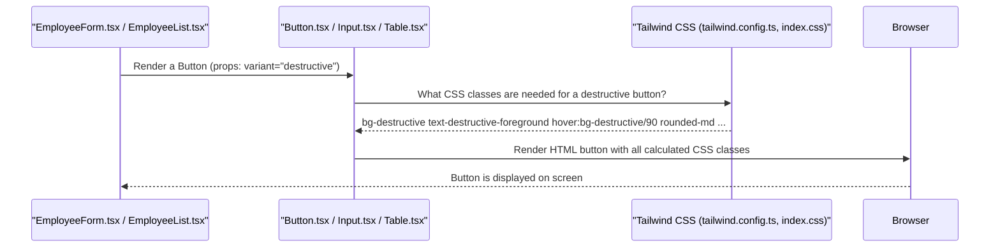

# Chapter 8: Reusable UI Components

In [Chapter 1: Data Models & Validation](01_data_models___validation_.md), we created the blueprints for our data. [Chapter 2: Database Interaction Layer](02_database_interaction_layer_.md) showed us how to store and retrieve it. [Chapter 3: API Endpoints](03_api_endpoints_.md) provided the "menu" for server communication, and [Chapter 4: Authentication & Authorization](04_authentication___authorization_.md) added critical security checks. [Chapter 5: Server Orchestration](05_server_orchestration_.md) tied the backend pieces together, and [Chapter 6: Client-Side Data Management](06_client_side_data_management_.md) showed how the frontend efficiently fetches and updates data. Finally, [Chapter 7: User Interface Routing](07_user_interface_routing_.md) guided us on how `PayrollPro` organizes its different screens and allows users to move between them.

Now that we know *what* pages `PayrollPro` has and *how* to navigate to them, the next question is: How do we actually *build* those pages? How do we make sure buttons, forms, and tables on different pages look and feel the same, without having to build them from scratch every single time?

### What Problem Are We Solving? (The LEGO Bricks Analogy)

Imagine you're building a complex city using LEGOs. You wouldn't build every single brick from raw plastic for every building, right? Instead, you'd use pre-made, standardized LEGO bricks: a red 2x4 brick, a clear window piece, a door frame, a roof tile. You combine these standard bricks in different ways to build houses, cars, and towers.

*   **The Problem:** In `PayrollPro`, we need many similar visual elements:
    *   Buttons: "Save," "Cancel," "Add Employee," "Delete."
    *   Input Fields: For names, salaries, dates, email addresses.
    *   Tables: To display lists of employees, payrolls, or departments.
    *   Cards: To group related information (like an employee's profile card).
    *   Pop-up windows (Dialogs): For confirmations or forms.

If we build each of these elements from scratch every time, they might look slightly different on different pages. It would also take a very long time, and if we wanted to change the look of *all* buttons, we'd have to change code everywhere!

This is where **Reusable UI Components** come in. They are like `PayrollPro`'s set of consistent LEGO bricks. We build them once, style them once, and then use them throughout the application.

**Our central use case for this chapter:** We want to build the "Add New Employee" form and the "Employee List" page. How can we ensure they both use consistent buttons, input fields, and a table, and are easy to build and maintain?

### Core Concepts: Our UI LEGO Set

Let's break down the key ideas behind these visual building blocks:

#### 1. What are UI Components?

A **UI Component** is a small, self-contained piece of the user interface. Think of it as a mini-application that handles its own look and some basic behavior.

*   **Examples in `PayrollPro`**: A `Button`, an `Input` field, a `Card` that displays information, a `Table` to show lists, or a `Dialog` (a pop-up window).
*   **Encapsulation**: Each component focuses on one thing. A `Button` component knows how to look and what to do when clicked; it doesn't care about fetching data or user login.

#### 2. Why Use Reusable Components? (The Benefits)

| Benefit        | Description                                                                                             | Example in `PayrollPro`                                   |
| :------------- | :------------------------------------------------------------------------------------------------------ | :-------------------------------------------------------- |
| **Consistency** | All elements of the same type look and feel identical across the application.                           | Every "Save" button, whether on the employee form or department form, has the same blue color and rounded corners. |
| **Speed**      | Once a component is built, you can use it instantly anywhere else, just like snapping LEGOs together.    | Building a new "Add Department" form is fast because you just grab pre-made `Input` and `Button` components. |
| **Maintainability** | If you need to change how a component looks (e.g., make all buttons slightly larger), you change it in *one place*. | To make all `Input` fields have a red border, you update the `Input` component file, and the change applies everywhere. |
| **Readability** | Your page code becomes cleaner because you're using meaningful component names instead of raw HTML.       | Instead of `<button class="bg-blue-500 ...">`, you write `<Button>`. |

#### 3. How They Work: Properties (Props) and Composition

*   **Properties (Props):** Components often need a way to be customized slightly when used. This is done through **props** (short for properties). They are like knobs or switches you can set when using a component.
    *   A `Button` might have a `variant` prop (e.g., "default", "destructive") to change its color, or an `onClick` prop to tell it what to do when clicked.
    *   An `Input` might have a `placeholder` prop to show hint text, or a `type` prop (e.g., "text", "password", "number").
*   **Composition:** Just like larger LEGO models are built from smaller LEGO bricks, complex UI components (like a full "Employee Form") are built by combining many smaller, reusable UI components (`Input`, `Button`, `Dialog`).

### Solving Our Use Case: Building with LEGOs

Let's apply this to our goal: building the "Add New Employee" form and the "Employee List" page with consistency.

**Scenario: Building an "Add New Employee" Form**
Instead of writing all the HTML and CSS for each input field, label, and button from scratch, we use our reusable components:

```html
<!-- Imagine this is what our React code would look like conceptually -->
<Dialog isOpen={isFormOpen} onClose={handleClose}>
  <DialogHeader>
    <DialogTitle>Add New Employee</DialogTitle>
  </DialogHeader>
  <DialogContent>
    <Form>
      <FormField name="firstName">
        <FormLabel>First Name</FormLabel>
        <FormControl><Input placeholder="John" /></FormControl>
      </FormField>
      <FormField name="lastName">
        <FormLabel>Last Name</FormLabel>
        <FormControl><Input placeholder="Doe" /></FormControl>
      </FormField>
      <!-- ... more fields using Input component ... -->
    </Form>
  </DialogContent>
  <DialogFooter>
    <Button variant="outline" onClick={handleCancel}>Cancel</Button>
    <Button type="submit">Save Employee</Button>
  </DialogFooter>
</Dialog>
```
*   Notice how easy it is to read! We're using `<Dialog>`, `<DialogHeader>`, `<Input>`, `<Form>`, `<Button>`. These are all pre-built, reusable components.
*   The `Input` components are guaranteed to look consistent everywhere.
*   The `Button` components can be easily changed (e.g., `variant="outline"` for "Cancel" to make it look different from "Save").

**Scenario: Building the "Employee List" Page**
Similarly, for displaying a list of employees:

```html
<!-- Conceptual code for the Employee List page -->
<Card>
  <CardHeader>
    <CardTitle>All Employees</CardTitle>
    <Input placeholder="Search employees..." />
  </CardHeader>
  <CardContent>
    <Table>
      <TableHeader>
        <TableRow>
          <TableHead>Name</TableHead>
          <TableHead>Position</TableHead>
          <TableHead>Department</TableHead>
          <TableHead>Actions</TableHead>
        </TableRow>
      </TableHeader>
      <TableBody>
        <TableRow>
          <TableCell>Alice Smith</TableCell>
          <TableCell>Manager</TableCell>
          <TableCell>HR</TableCell>
          <TableCell>
            <Button variant="ghost">Edit</Button>
            <Button variant="destructive">Delete</Button>
          </TableCell>
        </TableRow>
        <!-- ... more employee rows using TableRow and TableCell ... -->
      </TableBody>
    </Table>
  </CardContent>
</Card>
```
*   Here we use `<Card>` to frame the content, and a collection of `<Table>`, `<TableHeader>`, `<TableRow>`, and `<TableCell>` components to build the list.
*   The search bar uses our `Input` component, and the action buttons use our `Button` component.

This approach ensures `PayrollPro` has a polished, professional, and consistent look, and it's much quicker to add new features or redesign existing ones.

### How it Works Behind the Scenes

Our reusable UI components are essentially small React functions that return a piece of HTML (or other components). They often use a utility called `cn` (from a library like `clsx` or custom-made) to smartly combine CSS classes, allowing them to have a base style while also accepting custom styles when needed.

The styling for these components largely comes from **Tailwind CSS**, which is configured in `tailwind.config.ts` and used via CSS classes in `client/src/index.css`. This setup allows us to quickly apply styles (like `bg-primary`, `rounded-md`, `h-10`) directly in our component code without writing traditional CSS rules for every single element. `theme.json` also defines the primary colors that are then used by Tailwind CSS in `tailwind.config.ts`.



In this flow:
1.  A **Page Component** (like `EmployeeForm.tsx`) decides to use a **UI Component** (like `Button.tsx`). It passes some specific `props` (like `variant="destructive"`).
2.  The `UIComponent` internally calculates which CSS classes it needs based on its base styles and the `props` it received. It references the **Styling System** (Tailwind CSS, which is configured by `tailwind.config.ts` and `index.css`) to understand what `bg-destructive` or `rounded-md` mean visually.
3.  The `UIComponent` then tells the **Browser** to draw a standard HTML element (like `<button>`) but with all these specific CSS classes attached.
4.  The **Browser** displays the final, consistently styled button on the screen.

### Peeking at the Code: `client/src/components/ui/`

`PayrollPro` stores its reusable UI components in the `client/src/components/ui/` directory. You'll find files like `button.tsx`, `input.tsx`, `table.tsx`, `card.tsx`, `dialog.tsx`, and `form.tsx` there. These are the building blocks.

Let's look at simplified versions of a `Button` and an `Input` component to see how they are structured.

#### 1. The `Button` Component (`client/src/components/ui/button.tsx`)

This component defines how all buttons in `PayrollPro` will look.

```typescript
// --- File: client/src/components/ui/button.tsx (Simplified) ---
import * as React from "react";
import { cn } from "@/lib/utils"; // A small helper to combine CSS class names

// These define the base look for our button
const baseButtonStyles = "inline-flex items-center justify-center rounded-md text-sm";

// This is the actual React component for our Button
const Button = React.forwardRef<HTMLButtonElement, React.ButtonHTMLAttributes<HTMLButtonElement>>(
  ({ className, children, ...props }, ref) => {
    return (
      <button
        // 'cn' combines our base styles with any extra styles ('className')
        className={cn(baseButtonStyles, className)}
        ref={ref} // Allows other components to "reference" this button
        {...props} // Passes down any other standard HTML button properties
      >
        {children} {/* This is the text or content inside the button */}
      </button>
    );
  }
);
Button.displayName = "Button"; // Helps with debugging
export { Button };
```
*   `React.forwardRef`: This allows other parts of our application to "get a handle" on the actual HTML button element, which is useful for things like managing focus.
*   `className={cn(baseButtonStyles, className)}`: This is where the magic happens for styling. `baseButtonStyles` provides the common look (like rounded corners, font size). The `className` prop allows us to add *extra* styles (e.g., `className="bg-red-500"` would override the background color). `cn` intelligently combines these.
*   `{children}`: This allows us to put anything inside the button, like text ("Save") or an icon.

#### 2. The `Input` Component (`client/src/components/ui/input.tsx`)

Similarly, the `Input` component provides a consistent look for all text input fields.

```typescript
// --- File: client/src/components/ui/input.tsx (Simplified) ---
import * as React from "react";
import { cn } from "@/lib/utils";

const Input = React.forwardRef<HTMLInputElement, React.InputHTMLAttributes<HTMLInputElement>>(
  ({ className, type, ...props }, ref) => {
    return (
      <input
        type={type} // e.g., "text", "password", "number"
        className={cn(
          "flex h-10 w-full rounded-md border border-input bg-background px-3 py-2 text-sm", // Base styles
          className // Any extra styles passed in
        )}
        ref={ref}
        {...props}
      />
    );
  }
);
Input.displayName = "Input";
export { Input };
```
*   This structure is very similar to the `Button`. It defines a consistent visual base for all input fields (height, border, background, padding) and then allows for custom `className` overrides.

#### 3. Styling Configuration (`tailwind.config.ts` and `client/src/index.css`)

The look and feel of these components (like `border-input`, `bg-background`, `text-primary-foreground`) come from **Tailwind CSS**. `tailwind.config.ts` defines our custom colors and sizes based on `theme.json`'s values, while `client/src/index.css` sets up the base CSS variables and some custom classes.

*   **`tailwind.config.ts`**: This file customizes how Tailwind CSS works. It defines things like `--primary` or `--background` colors, mapping them to actual color values. It also sets default `borderRadius` values, ensuring all rounded corners are consistent.
*   **`client/src/index.css`**: This CSS file uses the values from `tailwind.config.ts` to define CSS variables (like `--background: 0 0% 96.1%;`). Our reusable components then use these variables through Tailwind's utility classes (e.g., `bg-background` uses the `--background` variable). It also includes custom component classes like `sidebar-link` or `success-badge` for specific elements.

This entire system ensures that when you build `PayrollPro`'s user interface, you're not just creating visual elements, but assembling a consistent, easy-to-update, and fast-to-develop application using a well-defined set of building blocks.

### Conclusion

In this chapter, we've explored **Reusable UI Components**, the "LEGO bricks" of `PayrollPro`'s user interface. We learned that these pre-built, standardized visual elements (like `Button`, `Input`, `Table`, `Card`, and `Dialog`) ensure the application has a consistent look and feel. We also saw how using them makes building new features faster and maintaining the application much simpler, as changes to a component apply everywhere it's used. This approach, combined with our robust backend and client-side data management, completes the picture of how `PayrollPro` is built.

---
