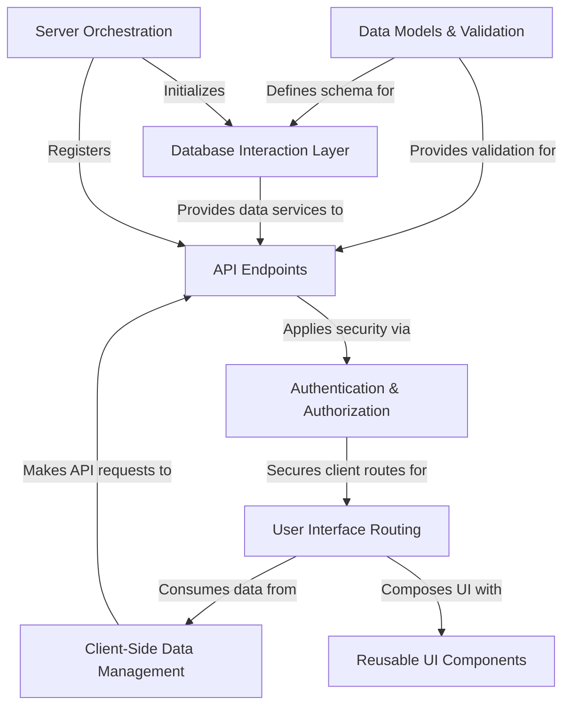
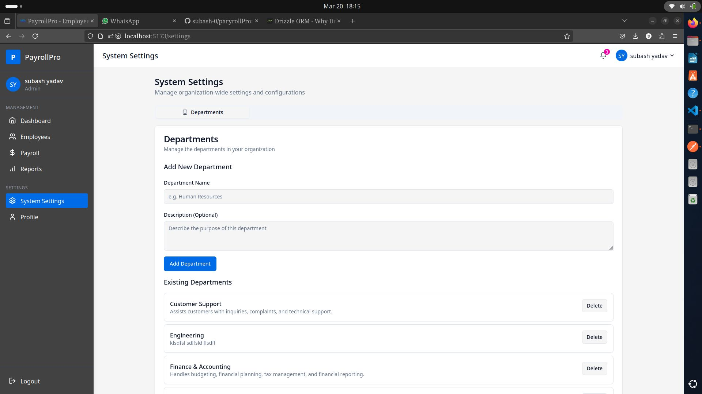
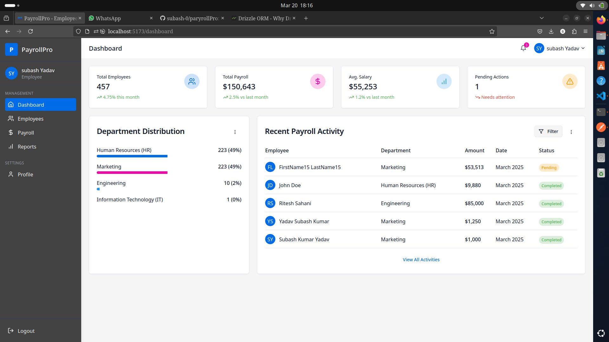
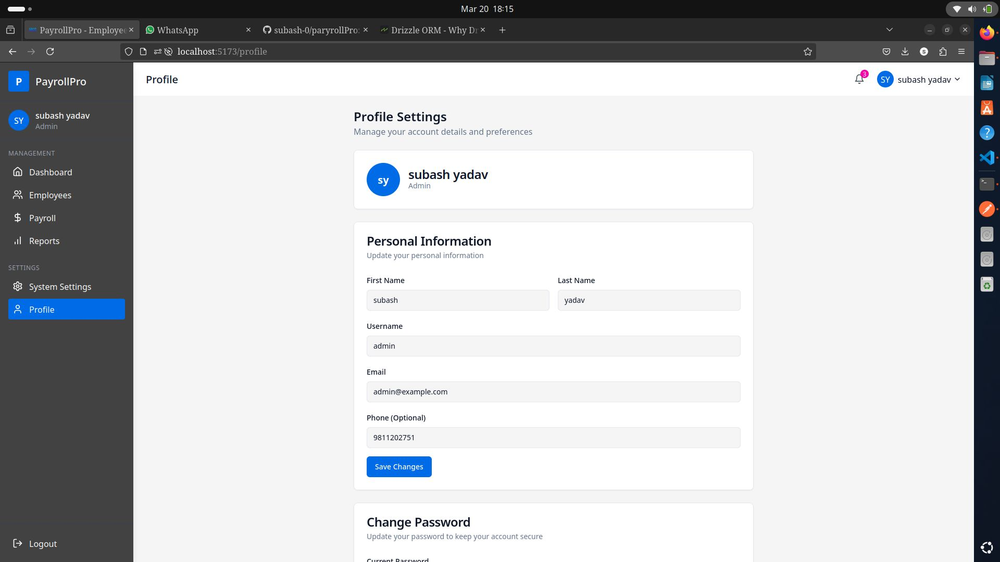
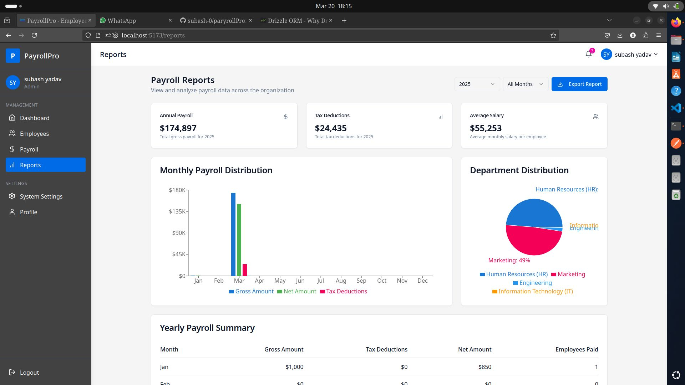

# Tutorial: paryrollPro

PayrollPro is an *employee payroll management system* designed to streamline HR and finance operations. It allows **administrators** to manage employee data, departments, process monthly payrolls, and generate detailed reports. *Employees* can view their payslips and personal information securely through a dedicated portal.

## Visual Overview

Visuals

  
  
  
     
  <!-- add more images as needed -->

## Chapters

1. [Data Models & Validation
](01_data_models___validation_.md)
2. [Database Interaction Layer
](02_database_interaction_layer_.md)
3. [API Endpoints
](03_api_endpoints_.md)
4. [Authentication & Authorization
](04_authentication___authorization_.md)
5. [Server Orchestration
](05_server_orchestration_.md)
6. [Client-Side Data Management
](06_client_side_data_management_.md)
7. [User Interface Routing
](07_user_interface_routing_.md)
8. [Reusable UI Components
](08_reusable_ui_components_.md)
